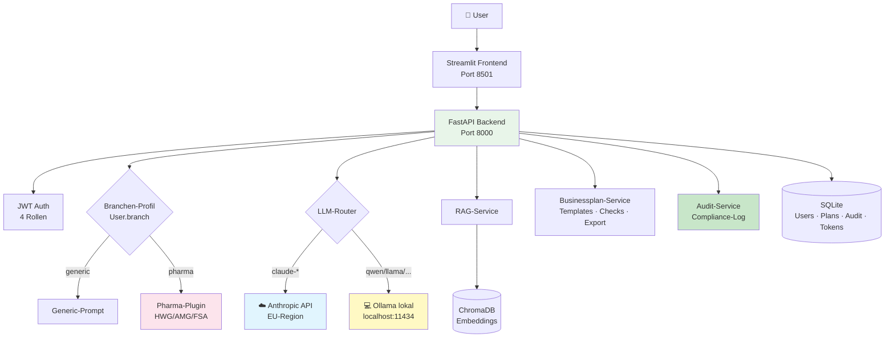
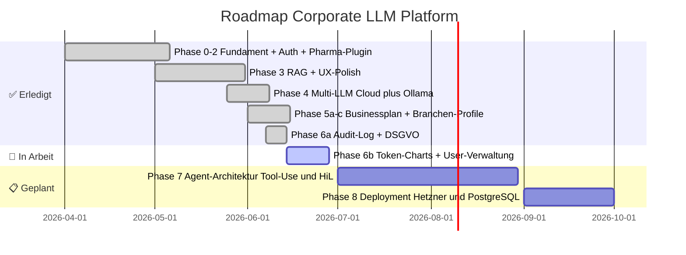

# 🤖 Corporate LLM Platform

> **Eine DSGVO/EU-AI-Act-konforme KI-Plattform für den deutschen Mittelstand.**
> Co-Pilot mit Audit-Trail — nicht Autopilot.
> Built and maintained by [Sascha Kern](https://github.com/verinaris).


---

## 🎯 Was diese Plattform ist

Eine produktiv lauffähige LLM-Plattform für den Mittelstand, die zeigt, **wie man KI in regulierten Branchen sicher einführt** — nicht in PowerPoint, sondern als echte, audit-fähige Software.

| Eigenschaft | Was das konkret heißt |
|---|---|
| 🇪🇺 **EU-First** | Anthropic EU-Region konfigurierbar, vollständig lokaler Betrieb via Ollama |
| 🔒 **Datenhoheit by Design** | Sensible Daten können das Haus nie verlassen |
| 📚 **RAG mit Quellen-Pflicht** | EU AI Act Art. 13 — jede Antwort mit nachvollziehbaren Quellen |
| 🧩 **Branchen-Profile** | Pharma-Mode mit HWG/AMG/FSA-Filter, erweiterbar |
| 📊 **Businessplan-Generator** | Bankenfähig, mit Härtungs-Checks + Fördermittel-Matching |
| 🛡️ **Audit-Trail** | DSGVO Art. 15 (Auskunft) + Art. 17 (Vergessenwerden) — eingebaut |
| 👥 **Rollen + Compliance** | Admin, Compliance-Officer, Pharma-Referent, User |
| 🌐 **Multi-LLM** | Cloud (Claude) und lokal (Ollama qwen2.5/llama) parallel |

> **Keine PowerPoint-Plattform.** Echte Software, die Sie selbst hosten können.

---

## 🏗️ Architektur



**Analogie:** Wie eine Telefonzentrale mit Mitschnitt — der Router schaltet je nach Anfrage und Sensibilität auf das passende "Gespräch" (externer Cloud-Anschluss oder interner Hausanschluss), und alles wird protokolliert für spätere Audits.

---

## ✨ Features im Detail

### 💬 Chat mit RAG + Quellenpflicht
- Anthropic Claude (Cloud, EU-Region) ODER lokales Ollama-Modell
- Modell wird dynamisch in der Sidebar gewählt
- RAG-Sammlungen mit PDF-Upload, Chunking, Embedding
- **Quellenangaben in jeder Antwort** (EU AI Act Art. 13 Transparenz-Pflicht)
- Branchen-spezifische System-Prompts (Pharma: HWG-Hinweise)

### 📊 Businessplan-Generator
- 3 Vorlagen: **KMU Standard**, **Pharma-Beratung & Vertrieb**, **Verinaris (Beispiel)**
- Vorlagen sind nach Branchen-Profil **gefiltert** (Pharma-User sieht Pharma-Vorlage, Generic-User nicht)
- 3-Jahres-Finanz-Forecast + 4-KPI-Scorecard (Reifegrad, Bankenfähigkeit, Förderfähigkeit, Investorenfähigkeit)
- **Härtungs-Checks** gegen IHK/HwK/Bank/BA/Compliance/Vertrieb
- **Industry-Checks** für Pharma: HWG-Werbeaussagen-Filter, DSGVO Art. 9, Pharmakovigilanz, lokales-LLM-Empfehlung
- Fördermittel-Matching mit **Regional-Filter** (DE, RP, BY, BW, NRW) und Branchen-Programmen (KMU-innovativ, ZIM, go-digital)
- Export: **Word**, **Excel** (4 Sheets), **PDF** (Executive Summary)

### 🏢 Branchen-Profile als 1. Klasse Bürger
- `User.branch` ist der **zentrale Schalter** der Plattform
- Wechselbar im UI (Sidebar)
- Steuert: Chat-Plugin, Businessplan-Vorlagen, Industry-Checks
- Erweiterbar: neue Branche = 1 Template-Datei + Mapping-Eintrag

### 🛡️ Audit-Trail + DSGVO
- **Audit-Log** mit 18 Action-Typen (Login, Branchen-Wechsel, Plan-Erstellung, ...)
- Filter nach User, Aktion, Zeitraum
- **DSGVO Art. 15** — Auskunftsrecht: vollständiger Datenexport als JSON
- **DSGVO Art. 17** — Recht auf Vergessenwerden: PII löschen + Pseudonymisierung von Token-Logs und Audit-Trail (gesetzliche Aufbewahrungspflicht 10 Jahre Pharma/Steuer bleibt erfüllt)
- Best-effort-Logging: Audit-Fehler bricht NIE die Hauptaktion ab

### 👥 Rollen
- **Admin**: voller Zugriff, DSGVO-Löschungen
- **Compliance-Officer**: Audit-Log lesen, Wissensbibliothek
- **Pharma-Referent**: Pharma-Branche aktiv, Chat + Businessplan
- **User**: Standard-Zugriff

---

## 🚀 Quick Start

### Voraussetzungen
- macOS / Linux (Windows mit WSL2)
- **Python 3.10 oder höher** (3.10, 3.11, 3.12 — getestet auf 3.12)
- [Ollama](https://ollama.com/download) für die lokale LLM-Demo (empfohlen)
- _Optional_: Anthropic API-Key, wenn du Claude Cloud zusätzlich nutzen willst

> ⚡ **Schnellster Einstieg**: Du brauchst KEINEN Anthropic-Key — die Demo läuft komplett lokal mit Ollama. Das ist auch die kompromissloseste DSGVO-Variante.

### In 5 Minuten

```bash
git clone https://github.com/verinaris/corporate-llm-platform.git
cd corporate-llm-platform

# 1. Python-Umgebung
python3 -m venv .venv && source .venv/bin/activate
pip install -r requirements.txt

# 2. Konfiguration
cp .env.example .env

# 3. JWT-Secret generieren und in .env eintragen
python -c "import secrets; print(secrets.token_urlsafe(32))"
# → Kopiere den Output in .env bei JWT_SECRET=...

# 4. WICHTIG bei Demo OHNE Anthropic-Key:
#    In .env setzen → DEFAULT_MODEL=qwen2.5:7b

# 5. Ollama-Modell laden (einmalig, ~5 GB)
ollama pull qwen2.5:7b

# 6. Backend starten (Terminal 1)
uvicorn app.main:app --reload

# 7. Frontend starten (Terminal 2)
streamlit run streamlit_app/app.py
```

→ Browser öffnet automatisch: http://localhost:8501
→ Login mit dem Bootstrap-Admin aus deiner `.env` (Default: `admin@example.com` / `ChangeMe-bitte-aendern`)

> 🛡 **Trial-Banner**: Die Plattform startet mit einer 7-tägigen Testphase. Nach Ablauf erscheint ein freundlicher Hinweis im UI — die App funktioniert aber weiter (siehe [Open Core](#-open-core-modell)).

---

## 📚 Dokumentation

| Was | Wo |
|---|---|
| **Architektur-Übersicht** | [`docs/architecture.md`](docs/architecture.md) |
| **Phasen-Dokumentation** | [`docs/phase-*.md`](docs/) |
| **Branchen-Plugin-Konzept** | [`docs/branchen-architektur.md`](docs/) |
| **Audit + DSGVO** | [`docs/phase-6a-audit-dsgvo.md`](docs/) |
| **Backlog (MoSCoW + INVEST)** | [`BACKLOG.md`](BACKLOG.md) |

---

## 🗺️ Roadmap



Vollständige Liste siehe [`BACKLOG.md`](BACKLOG.md).

---

## 🎓 Lessons Learned

Aus über 40 Phasen-Iterationen extrahiert — die strategisch wertvollsten:

1. **Provider-Abstraktion zahlt sich aus.** Erst Anthropic, dann Ollama — ohne den `BaseLLMClient` aus Phase 1 wäre Phase 4 ein Rewrite gewesen.

2. **Compliance ist kein Feature, sondern Architektur.** DSGVO/AI-Act-konforme Quellenangaben mussten im Daten-Modell sein, nicht im Frontend. Audit-Trail mit Pseudonymisierung haben wir vorausschauend designt.

3. **Lokale Modelle ändern das Verkaufsgespräch.** *"Patientendaten verlassen nie das Haus"* ist ein anderer Pitch als "wir vertrauen auf US-Cloud-SOC2".

4. **Doku ist Verkauf.** `BACKLOG.md` zeigt strategisches Denken; `docs/phase-*` zeigen Arbeitsweise. Recruiter, Berater-Kollegen und Kunden-DSBs lesen das genau.

5. **Branchen-Profile gehören auf die Plattform-Ebene, nicht ins Modul.** Wir mussten in Phase 5c refaktorieren, als das klar wurde — danach skaliert die Plattform pro Branche um ein Vielfaches schneller.

6. **Streaming-UX schlägt Polling.** Phasen-Status während Upload macht den Unterschied zwischen *"keine Ahnung wie lange"* und *"weiß was passiert"*.

7. **Human-in-the-Loop ist non-negotiable für reguliert.** Auto-Posten, Auto-Senden, Auto-Veröffentlichen sind Compliance-Killer in Pharma. Co-Pilot mit Freigabe-Schritt ist das verkaufbare Modell.

---

## 🛡️ Security & Compliance

- ✅ **Keine echten API-Keys** im Repo — alles via `.env.example`
- ✅ **`data/` ist .gitignored** — Uploads, DB, Embeddings bleiben lokal
- ✅ **JWT mit konfigurierbarem Secret** — Production-Validation in `config.py`
- ✅ **Audit-Log** mit IP-Adresse und Zeitstempel für alle Compliance-relevanten Aktionen
- ✅ **DSGVO Art. 15 + 17** vollständig implementiert
- ✅ **Streamlit-Telemetrie deaktiviert** — kein Daten-Leak an Drittsysteme
- ✅ **Quellen-Pflicht in RAG** — EU AI Act Art. 13 Transparenz-Anforderung
- ✅ **Pharmakovigilanz-Bewusstsein** in Plan-Templates

Siehe auch [`SECURITY.md`](SECURITY.md) für verantwortungsvolle Offenlegung.

---

## 🤝 Beratung & Kontakt

Wenn dein Unternehmen vor einer ähnlichen Entscheidung steht — KI einführen, Cloud-Strategie definieren, Compliance-Architektur aufsetzen, **kein Auto-Pilot sondern audit-fähiger Co-Pilot** — gerne ein unverbindliches Gespräch:

📧 s_mkern@t-online.de
🔗 [LinkedIn](https://www.linkedin.com/in/verinaris)
📍 Koblenz, Deutschland

> **Wichtig:** Dieses Repository ist **eine Referenz**, kein Produkt. Für eine produktive Einführung in Ihrem Unternehmen ist immer eine individuelle Architektur- und Compliance-Begleitung notwendig.

---

## 📄 Lizenz

[MIT](LICENSE) — kostenlos nutzbar, einschließlich kommerzielle Nutzung, ohne Gewährleistung.

---

<sub>Bauen statt erzählen. Compliance statt Hype. Co-Pilot statt Autopilot.</sub>

---

## 🎯 Open Core-Modell

Verinaris ist **Open Source unter MIT-Lizenz**. Die Plattform startet mit einer 7-tägigen Testphase, nach der ein freundlicher Hinweis im UI erscheint.

### Was bedeutet das in der Praxis?

| Modus | Was passiert |
|---|---|
| **Tag 1-6** | 🟢 Volle Nutzung, Trial-Banner zeigt verbleibende Zeit |
| **Tag 7 (< 24h)** | 🟡 Letzter-Tag-Hinweis, alle Funktionen weiter aktiv |
| **Ab Tag 8** | 🔴 Hinweis-Banner: "Testphase beendet" — App funktioniert **weiterhin** |
| **Mit Lizenz** | ✅ "Lizenzierte Version aktiv" (Phase 2) |

### Warum kein harter Schutz?

Da Verinaris Open Source ist, können Sie den Hinweis **selbstverständlich selbst entfernen**. Wir setzen auf Transparenz statt Schutz-Mauer:

- **Plattform-Kern** = MIT-Lizenz, kostenlos für jeden
- **Branchen-Profile** (Pharma HWG/AMG, Anwalt, Steuer) = später kommerziell verfügbar
- **Consulting + Setup** = Tagessatz-basiert (Beratung)
- **Enterprise-Features** (SSO, Lizenz-Verwaltung) = kommerziell (Phase 2)

### Was wir Sie bitten

Für **regulierte Branchen** und **Production-Einsatz** empfehlen wir den Verinaris Commercial Plan, der professionellen Support, Schulungen und branchen-spezifische Compliance-Profile beinhaltet.

→ Kontakt: [s_mkern@t-online.de](mailto:s_mkern@t-online.de)

> **Transparenz als Verkaufsargument.** Für CIOs und DSBs in regulierten Branchen ist Open Source kein Risiko — es ist ein Vertrauens-Hebel. Lesen Sie unseren Code, prüfen Sie ihn, hosten Sie ihn selbst.
