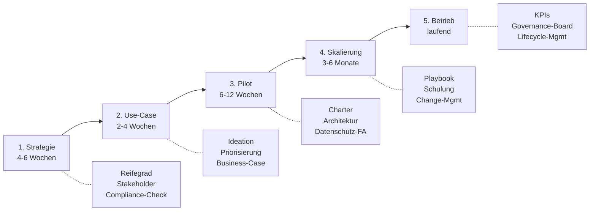

# 🧭 KI-Transformation Blueprint

> **Ein bewährtes 5-Phasen-Vorgehensmodell für KI-Einführungen im Mittelstand.**
> Compliance-First. Pragmatisch. Sofort einsetzbar.

---

## 🎯 Warum diese Vorlage existiert

KI-Einführungen scheitern selten an der Technik — sondern an unklarem
Vorgehen, schlechtem Use-Case-Scoring oder ungelösten Compliance-Fragen.
Dieser Blueprint ist die destillierte Erfahrung aus realen Mandaten —
generisch genug für Wiederverwendung, konkret genug für sofortigen Nutzen.

---

## 📊 Das 5-Phasen-Modell

| Phase | Hauptfrage | Wichtigstes Artefakt |
|---|---|---|
| **1. Strategie** | *Wo stehen wir, wo wollen wir hin?* | Reifegrad-Assessment + Roadmap |
| **2. Use-Case** | *Womit fangen wir an?* | Priorisierungs-Matrix + Business-Case |
| **3. Pilot** | *Funktioniert es bei uns?* | Pilot-Charter + Datenschutz-FA |
| **4. Skalierung** | *Wie wird es Alltag?* | Rollout-Playbook + Schulung |
| **5. Betrieb** | *Wie bleibt es wertvoll?* | KPI-Set + Governance-Board |

---

## 📁 Inhalt

### `01-strategie/`
- **reifegrad-assessment.md** — 7 Dimensionen, je 5 Reifestufen
- **stakeholder-mapping.md** — RACI für KI-Initiative
- **compliance-checkliste.md** — DSGVO / EU AI Act / BSI vorab prüfen

### `02-use-cases/`
- **ideation-canvas.md** — Strukturierte Use-Case-Erfassung
- **priorisierung-matrix.md** — Nutzen vs. Aufwand vs. Risiko
- **business-case-template.md** — Investment-Argumentation

### `03-pilot/`
- **pilot-charter-template.md** — Scope, Erfolg, Abbruchkriterien
- **architektur-decision-record.md** — ADR-Template
- **datenschutz-folgenabschätzung.md** — DSFA-Leitfaden

### `04-skalierung/`
- **rollout-playbook.md** — Phasen, Risiken, Kommunikation
- **schulungs-curriculum.md** — Was wer wann lernen muss

### `05-betrieb/`
- **governance-board-template.md** — Rollen, Frequenz, Agenda
- **kpi-katalog.md** — Was misst man bei produktiver KI?
- **lifecycle-management.md** — Wann ein Modell ablösen?

---

## 🛠️ Wie diese Templates zu nutzen sind

1. Fork / Clone dieses Repo
2. Kopiere die passende(n) Vorlagen in dein Projekt
3. Befülle die `<...>`-Platzhalter mit deinem Kontext
4. Behalte die Struktur — sie ist die Stärke der Vorlage

> **Tipp:** Lies das Glossar zuerst — viele Begriffe (BSI-Grundschutz,
> "Wesentlich" im AI-Act, "DSFA") haben juristische Spezifität.

---

## 📚 Glossar

Siehe [`glossar.md`](glossar.md) — 30+ Begriffe aus IT-Governance, DSGVO und
EU AI Act, praxisnah erklärt mit Quellenverweisen.

---

## 🗺️ Roadmap dieses Repos

- [x] **Q2/2026** — 5-Phasen-Modell als Skelett
- [ ] **Q3/2026** — Reifegrad-Assessment Beispiel-Auswertung
- [ ] **Q3/2026** — 3 Whitepaper zu typischen Stolpersteinen
- [ ] **Q4/2026** — Integration mit DSGVO-Folgenabschätzung (DSFA)

---

## 🎓 Lessons Learned (Auszug)

1. **Use-Cases überleben Reifegrad-Assessments selten unverändert.** Erst
   verstehen, was geht — dann scoren.

2. **Compliance-Check vor Pilot, nicht danach.** Eine DSFA, die im Pilot
   "noch nachgereicht wird", wird zur Bombe im Betrieb.

3. **"KI-Strategie ohne IT-Strategie" ist Symptombehandlung.** Wenn das
   ITSM nicht steht, wird KI nicht überleben.

---

## 🤝 Beratung

Du willst diesen Blueprint für dein Unternehmen anpassen?
📧 sascha.kern@nobelimpressions.com

---

## 📄 Lizenz

[CC BY 4.0](LICENSE) — frei nutzbar mit Namensnennung.
