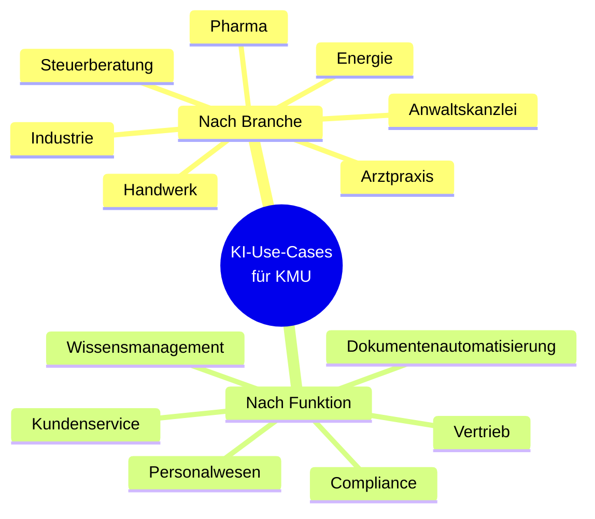

# 🎯 AI Use Cases for SMEs

> **Kuratierte KI-Anwendungsfälle für den deutschen Mittelstand.**
> Branchen-orientiert. Praxisnah. Mit Compliance-Hinweisen.


---

## 🎯 Warum dieses Repository

KI-Hype dominiert die Schlagzeilen — was im Mittelstand wirklich nutzt, ist
weniger sichtbar. Diese Sammlung kuratiert reale, KMU-taugliche
Anwendungsfälle: branchen- und funktionsbezogen, mit konkretem Nutzen,
realistischem Aufwand und ehrlichem Datenschutz-Vermerk.

---

## 📊 Übersicht



---

## 📁 Inhalt

### Nach Branche (`nach-branche/`)
- `handwerk.md` — Angebotskalkulation, Materialdisposition, Termine
- `pharma.md` — Außendienst-Vorbereitung (NIE Patientendaten!),
  Fachinfos, HWG-Check
- `energie.md` — Lastprognose, Störungsanalyse, EEG-Compliance
- `steuerberatung.md` — DATEV-Buchungssatz-Vorschlag, BMF-Schreiben-RAG
- `anwaltskanzlei.md` — Mandantenakten-Suche, Vertragsentwurf
- `arztpraxis.md` — Anamnese-Strukturierung (lokal!), Arztbrief-Generator
- `industrie.md` — Predictive Maintenance, Qualitätskontrolle

### Nach Funktion (`nach-funktion/`)
- `vertrieb.md` — Lead-Qualifizierung, Angebotsentwürfe
- `personalwesen.md` — Stellenbeschreibungen, Bewerber-Screening (heikel!)
- `compliance.md` — DSGVO-Folgenabschätzung-Unterstützung, Audit-Vorbereitung
- `kundenservice.md` — Erstantwort-Drafts, Wissensbank-Q&A
- `wissensmanagement.md` — Internes RAG, Handbuch-Suche
- `dokumentenautomatisierung.md` — Verträge, Berichte, E-Mails

---

## 🧩 Struktur eines Use-Case (Template)

```markdown
# UC-XX: [Titel des Use-Cases]

**Branche / Funktion:** ...
**Typischer Anwender:** ...
**Reifegrad in der Praxis:** [Experiment / Pilot / Produktiv-tauglich]

## Problem
[Worum geht es? Wo schmerzt es konkret?]

## KI-Ansatz
[Welche Art von KI? RAG, Klassifikation, Generation, …]

## Erwarteter Nutzen
- Quantitativ: [Zeitersparnis, Fehlerreduktion, ...]
- Qualitativ: [Mitarbeiterzufriedenheit, Servicequalität, ...]

## Aufwand
- Initial: [Stunden / Personentage]
- Laufend: [Stunden/Monat für Betrieb]

## Datenschutz & Compliance
- DSGVO: [Personenbezogene Daten ja/nein, welche Kategorie]
- EU AI Act: [High-Risk? Transparency-Anforderungen?]
- Branchen-Spezifika: [HWG, GoBD, BDSG, ...]

## Empfehlung: Cloud oder lokal?
[Argumentation, was Sinn ergibt]

## Empfohlene Tools / Modelle
[Konkrete Hinweise — keine Empfehlung von Mitbewerber-Lösungen]
```

---

## 🚦 Compliance-Ampel pro Use-Case

Jeder Use-Case ist mit einer Ampel versehen:

- 🟢 **Grün** — DSGVO/AI-Act unkritisch, Cloud-LLM OK
- 🟡 **Gelb** — Personenbezogene Daten, ggf. Pseudonymisierung erforderlich
- 🔴 **Rot** — Hochsensibel (Patienten-, Mandantendaten); nur lokales LLM

---

## 🗺️ Roadmap

- [x] **Q2/2026** — Repo-Skelett + 5 Use-Cases
- [ ] **Q3/2026** — 15 Use-Cases (3 Branchen × 5)
- [ ] **Q4/2026** — Use-Cases mit Mini-Demos aus Corporate LLM Platform
- [ ] **Q1/2027** — Self-Assessment-Tool ("Was passt für mein Unternehmen?")

---

## 🎓 Lessons Learned

1. **"KI muss alles können" ist falsch.** Punktgenaue Use-Cases mit
   schmalem Scope haben die höchste Erfolgsquote.

2. **Pharma + KI = HWG-Falle.** Werbeaussagen-Filter sind kein Nice-to-Have.

3. **Lokale Modelle ändern die Beratung.** Was vor 18 Monaten "geht nicht
   ohne Cloud" war, ist heute auf einem Macbook möglich.

---

## 🤝 Use-Case-Workshop

Wir können diese Sammlung in einem 2-stündigen Workshop auf dein
Unternehmen anpassen. Schreib mir:
📧 sascha.kern@nobelimpressions.com

---

## 📄 Lizenz

[CC BY 4.0](LICENSE)
