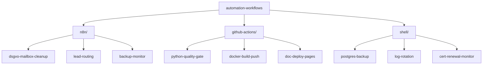

# ⚙️ Automation Workflows

> **Wiederverwendbare Automation-Bausteine für IT-Operations.**
> n8n · GitHub Actions · Shell. Praxis-erprobt, dokumentiert, sicher.


---

## 🎯 Was hier drin ist

Automation ist die **dritte Säule** moderner IT-Strategie (neben Architektur
und Sicherheit) — aber die Bausteine sind oft Eigenentwicklungen, die
niemand teilt. Diese Sammlung bricht das auf: 5-10 sofort nutzbare Workflows
mit klarer Dokumentation und Risiko-Hinweisen.

---

## 📊 Übersicht



---

## 📁 Inhalt (Beispiele)

### `n8n/` — Low-Code-Workflows

#### `dsgvo-mailbox-cleanup/`
Automatische DSGVO-konforme Bereinigung alter E-Mails nach Aufbewahrungsfrist.
- **Trigger:** Daily 02:00 Uhr
- **Schritte:** IMAP-Scan → Älter als X Tage? → Pseudonymisieren → Archivieren → Löschen
- **Voraussetzung:** n8n-Instanz, IMAP-Zugang, S3-kompatibles Archiv
- **Aufwand:** ~2h Setup, dann selbstlaufend

#### `lead-routing/`
Eingangs-E-Mails klassifizieren und an die richtige Person routen.
- **Trigger:** Webhook (Postfach-Forwarder)
- **Schritte:** Spam-Filter → KI-Klassifikation → Slack-Channel + CRM-Eintrag

### `github-actions/` — CI/CD-Vorlagen

#### `python-quality-gate/`
Wiederverwendbares Workflow: ruff + black + pytest + coverage-gate.
```yaml
# Auszug aus .github/workflows/quality.yml
name: Quality Gate
on: [push, pull_request]
jobs:
  quality:
    uses: <user>/automation-workflows/.github/workflows/python-quality.yml@main
    with:
      python-version: '3.12'
      min-coverage: '60'
```

### `shell/` — Klassische Sysadmin-Bausteine

#### `postgres-backup/`
Daily Backup nach S3, mit Restore-Test, Notification bei Fehler.
```bash
# Beispiel-Ausführung
./postgres-backup.sh \
  --db-url postgres://... \
  --target s3://backup-bucket/postgres/ \
  --retention-days 30 \
  --slack-webhook https://...
```

---

## 🛡️ Sicherheits-Hinweise (WICHTIG)

Jeder Workflow hat eine eigene `SECURITY.md` mit:
- Welche Berechtigungen er braucht (least privilege!)
- Welche Daten er verarbeitet (DSGVO-relevant?)
- Wie Secrets gehandhabt werden (NIE im Workflow-File!)
- Was schief gehen kann und wie man's bemerkt

**Vor dem Einsatz IMMER:**
1. Workflow lesen, nicht blind ausführen
2. Mit Test-Daten / Staging-System anfangen
3. Logs einrichten BEVOR der Workflow scharf geht
4. Notfall-Stop-Mechanismus prüfen (kill switch)

---

## 🗺️ Roadmap

- [x] **Q2/2026** — Repo + 3 Workflows (1 pro Kategorie)
- [ ] **Q3/2026** — 5 Workflows je Kategorie (15 gesamt)
- [ ] **Q3/2026** — Video-Walkthrough für jeden Workflow
- [ ] **Q4/2026** — Integration mit Corporate LLM Platform

---

## 🎓 Lessons Learned

1. **n8n schlägt selbstgeschriebenen Code für 90% der Routine-Automationen.**
   Wartbarkeit > Vollkontrolle.

2. **GitHub Actions ist mehr als CI/CD.** Cron-Jobs, Doku-Deploys,
   Lizenz-Scans — viel mehr als nur Tests.

3. **Shell-Skripte sind nicht tot.** Für Dinge wie Backups, Log-Rotation,
   Cert-Monitoring nicht überengineeren.

---

## 🤝 Workflow-Workshop

Du willst Automation in deinem Unternehmen aufbauen, weißt aber nicht wo
anfangen? Ich biete Audit-Workshops an:
📧 sascha.kern@nobelimpressions.com

---

## 📄 Lizenz

[MIT](LICENSE)
