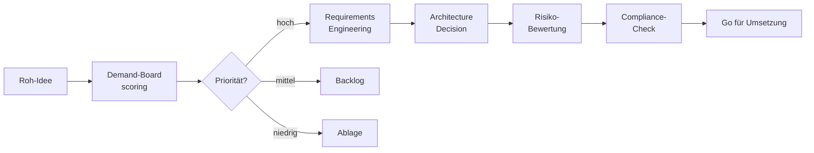

# 📋 IT-Governance Templates

> **Sofort einsetzbare Vorlagen für IT-Steuerung im Mittelstand.**
> RACI · Demand · Requirements · ADRs · Risiko · DSGVO.


---

## 🎯 Was hier drin ist

IT-Governance scheitert oft an einem von zwei Extremen:
- **"Wir machen erstmal" ohne Struktur** → spätere Bürokratie-Welle
- **Enterprise-Frameworks 1:1 für 50 Leute übernehmen** → niemand nutzt es

Diese Vorlagen sind der pragmatische Mittelweg — schlank, KMU-tauglich,
aber strukturiert genug für Audits.

---

## 📁 Inhalt

### `raci-matrizen/`
- **itil-incident-management.md** — Wer ist verantwortlich bei welcher Eskalationsstufe?
- **ai-governance-board.md** — Wer entscheidet über KI-Use-Cases?
- **vorfall-datenschutz.md** — DSGVO Art. 33-Meldepflicht in 72h

### `demand-management/`
- **backlog-template.md** — MoSCoW + INVEST (bewährt im Mittelstand)
- **priorisierungs-canvas.md** — Strategischer Nutzen vs. Umsetzbarkeit
- **demand-board-charter.md** — Mandat des Demand-Boards

### `requirements/`
- **funktional-template.md** — User-Stories mit Akzeptanzkriterien
- **nicht-funktional-template.md** — Performance, Sicherheit, Compliance
- **stakeholder-mapping.md** — Wer hat Anforderungen, wer entscheidet?

### `architecture/`
- **adr-template.md** — Architecture Decision Record
- **landscape-canvas.md** — Anwendungs-Landschaft auf einer Seite
- **integration-pattern-catalog.md** — Typische EAI-Muster

### `risk/`
- **risikoregister-template.xlsx** — Klassifikation, Eintrittswahrscheinlichkeit, Schadensausmaß
- **risiko-bewertungs-leitfaden.md** — Wie man bewertet, ohne in Excel-Hölle zu enden

### `compliance/`
- **dsgvo-verarbeitungsverzeichnis.xlsx** — VV nach Art. 30 DSGVO
- **ai-act-klassifizierung.md** — Ist mein System "High-Risk"?
- **bsi-grundschutz-mapping.md** — KMU-tauglicher Einstieg

---

## 🧩 Beispiel: ADR-Template

```markdown
# ADR-NNNN: [Titel]

**Status:** [Vorgeschlagen | Akzeptiert | Abgelehnt | Überholt]
**Datum:** YYYY-MM-DD
**Autor:** [Name, Rolle]

## Kontext
[Was ist die Ausgangslage? Welche Faktoren zwingen zur Entscheidung?]

## Entscheidung
[Was wurde entschieden — kurz und klar]

## Begründung
[Warum so? Welche Alternativen wurden geprüft?]

## Konsequenzen
[Was bedeutet das? Positiv UND negativ benennen.]

## Referenzen
[Quellen, Studien, andere ADRs]
```

---

## 📊 Wie diese Vorlagen wirken



Jede Vorlage hat ihren Platz in der Wertschöpfungskette — nicht jeder
Vorgang braucht alles, aber bei Bedarf weiß man wo nachschlagen.

---

## 🗺️ Roadmap

- [x] **Q2/2026** — 6 Vorlagen Kern-Set (RACI, Demand, ADR, …)
- [ ] **Q3/2026** — Beispiel-Ausfüllungen für 3 typische KMU-Szenarien
- [ ] **Q3/2026** — Video-Walkthroughs (5-10 Min je Vorlage)
- [ ] **Q4/2026** — Vergleich mit ITIL 4 / COBIT 2019 — "Was ist Pflicht, was Kür?"

---

## 🎓 Lessons Learned

1. **Vorlagen müssen nutzbar sein, nicht vollständig.** 1-Seiten-Charter
   schlägt 30-Seiten-Konzept in 80% der Fälle.

2. **DSGVO-Verarbeitungsverzeichnis ist nicht optional.** Wer es noch nicht
   hat, hat ein Audit-Problem — nicht eine Doku-Aufgabe.

3. **ADRs sind Gedächtnis.** Nach 6 Monaten weiß niemand mehr, warum man
   damals X gewählt hat. ADR schließt diese Lücke.

---

## 🤝 Governance-Workshop

Eintägiger Workshop "IT-Governance light" für KMU verfügbar:
📧 sascha.kern@nobelimpressions.com

---

## 📄 Lizenz

[CC BY 4.0](LICENSE) — frei nutzbar mit Namensnennung.
