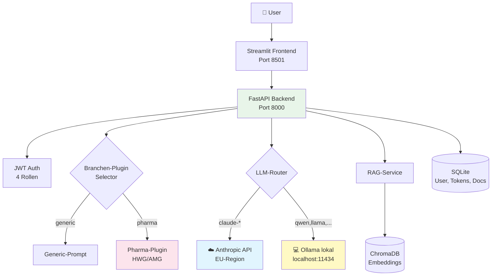
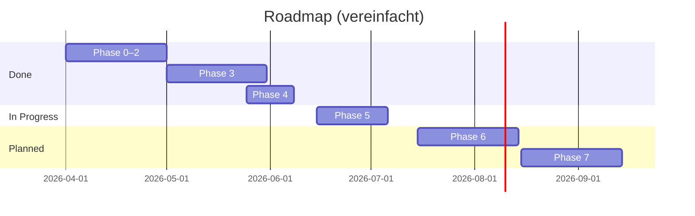

# 🤖 Corporate LLM Platform

> **Eine DSGVO/EU AI Act-konforme KI-Plattform für den deutschen Mittelstand.**
> Built and maintained by [Sascha Kern](https://github.com/<user>) —
> als lebendiger Beweis, dass KI-Strategie und KI-Umsetzung in einer Hand
> möglich sind.


---

## 🎯 Was diese Plattform ist

Eine produktiv lauffähige LLM-Plattform für den Mittelstand, die zeigt,
wie man **KI sicher einführt** — nicht in PowerPoint, sondern als echte Software.

| Eigenschaft | Was das heißt |
|---|---|
| 🇪🇺 **EU-First** | Anthropic EU-Region konfigurierbar, lokale Modelle via Ollama |
| 🔒 **Datenschutz by Design** | Sensible Daten können vollständig lokal bleiben |
| 📚 **RAG mit Quellen-Pflicht** | EU AI Act Art. 13 — Antworten mit nachvollziehbaren Quellen |
| 🧪 **Branchen-Plugins** | z.B. Pharma mit HWG/AMG-Compliance-Prompts |
| 👥 **Rollen + Audit** | 4 Rollen, Token-Logging, DSGVO Art. 30 vorbereitet |
| 🌐 **Multi-LLM** | Cloud (Claude) und lokal (Ollama) parallel |

> **Keine PowerPoint-Plattform.** Echte Software, die Sie selbst hosten können.

---

## 🏗️ Architektur



**Analogie:** Wie eine Telefonzentrale — der Router schaltet je nach Anfrage
auf das passende "Gespräch": externer Cloud-Anschluss (Claude) oder interner
Hausanschluss (Ollama). Bei vertraulichen Themen bleibt das Gespräch im Haus.

---

## 🚀 Quick Start

### Voraussetzungen
- macOS / Linux (Windows mit WSL2)
- Python 3.12+
- [Ollama](https://ollama.com/download) (für lokale Modelle, optional)

### In 5 Minuten

```bash
git clone https://github.com/<user>/corporate-llm-platform.git
cd corporate-llm-platform
python -m venv .venv && source .venv/bin/activate
pip install -r requirements.txt

cp .env.example .env
# .env editieren: ANTHROPIC_API_KEY, JWT_SECRET, ADMIN_EMAIL, ADMIN_PASSWORD

# Terminal 1
uvicorn app.main:app --reload

# Terminal 2
streamlit run streamlit_app/app.py

# Optional Terminal 3 für lokale Modelle:
ollama serve
ollama pull qwen2.5:7b
```

→ Browser: http://localhost:8501

---

## 📚 Dokumentation

| Was | Wo |
|---|---|
| **Architektur-Übersicht** | [`docs/architecture.md`](docs/architecture.md) |
| **Phasen-Doku (von 0 bis aktuell)** | [`docs/phase-*.md`](docs/) |
| **Branchen-Plugin-Konzept** | [`docs/branchen-architektur.md`](docs/branchen-architektur.md) |
| **BFSG / Accessibility** | [`docs/quick-wins-bfsg-cloud.md`](docs/) |
| **Backlog (MoSCoW + INVEST)** | [`BACKLOG.md`](BACKLOG.md) |

---

## 🗺️ Roadmap (Auszug)



Vollständige Liste siehe [`BACKLOG.md`](BACKLOG.md).

---

## 🎓 Lessons Learned

Aus über 30 Phasen-Iterationen extrahiert — hier die strategisch wertvollsten:

1. **Provider-Abstraktion zahlt sich aus.** Erst Anthropic, dann Ollama — ohne
   den `BaseLLMClient` aus Phase 1 wäre Phase 4 ein Rewrite gewesen.

2. **Compliance ist kein Feature, sondern Architektur.** DSGVO/AI-Act-konforme
   Quellenangaben mussten im Daten-Modell sein, nicht im Frontend.

3. **Lokale Modelle ändern das Verkaufsgespräch.** *"Patientendaten verlassen
   nie das Haus"* ist ein anderer Pitch als "wir vertrauen auf US-Cloud-SOC2".

4. **Doku ist Verkauf.** `BACKLOG.md` zeigt strategisches Denken; `docs/phase-*`
   zeigen Arbeitsweise. Recruiter und Berater-Kollegen lesen das genau.

5. **Streaming-UX schlägt Polling.** Phasen-Status während Upload macht den
   Unterschied zwischen *"keine Ahnung wie lange"* und *"weiß was passiert"*.

---

## 🛡️ Security & Compliance

- ✅ **Keine echten API-Keys** im Repo — alles via `.env.example`
- ✅ **`data/` ist .gitignored** — Uploads, DB, Embeddings bleiben lokal
- ✅ **JWT mit konfigurierbarem Secret** — Production-Validation in `config.py`
- ✅ **Streamlit-Telemetrie deaktiviert** — kein Daten-Leak an Drittsysteme
- ✅ **Quellen-Pflicht in RAG** — EU AI Act Art. 13 Transparenz-Anforderung

Siehe auch [`SECURITY.md`](SECURITY.md) für Verantwortungsoffenlegung.

---

## 🤝 Beratung & Kontakt

Wenn dein Unternehmen vor einer ähnlichen Entscheidung steht — KI einführen,
Cloud-Strategie definieren, Compliance-Architektur aufsetzen — gerne ein
unverbindliches Gespräch:

📧 sascha.kern@nobelimpressions.com
🔗 [LinkedIn-Link einfügen]

> **Wichtig:** Dieses Repository ist **eine Referenz**, kein Produkt.
> Für eine produktive Einführung in Ihrem Unternehmen ist immer eine
> individuelle Architektur- und Compliance-Begleitung notwendig.

---

## 📄 Lizenz

[MIT](LICENSE) — kostenlos nutzbar, einschließlich kommerzielle Nutzung,
ohne Gewährleistung.
