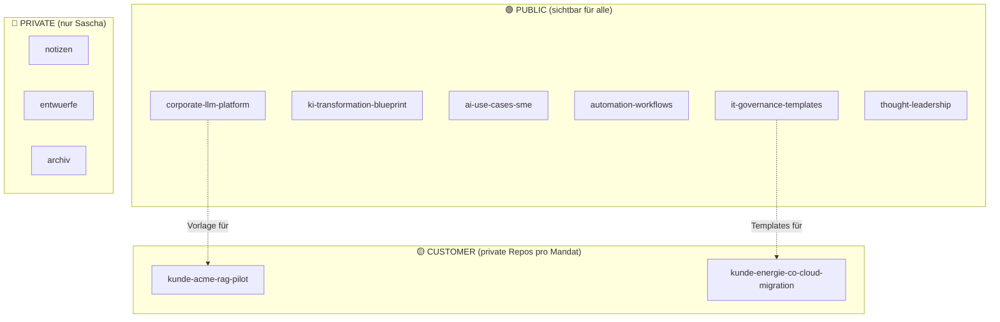
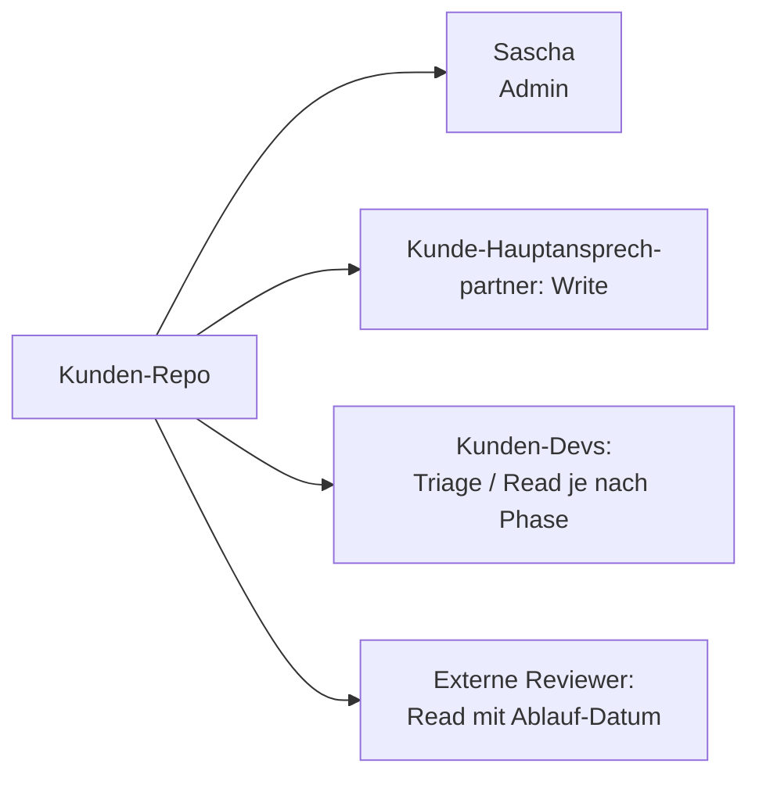
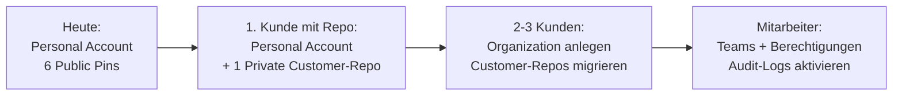

# 04 — Zugriffsmodell: Public / Customer / Private

> **Leitprinzip:** Sichtbares Vertrauensgefüge. Wer welchen Code sieht, ist
> Teil deiner Glaubwürdigkeit.

---

## 🎯 Die drei Ebenen



---

## 🟢 Public Repositories

| Was | Wer sieht | Wer kann commiten |
|---|---|---|
| 6 Showcase-Repos (siehe `02-repository-struktur.md`) | Alle (inkl. Recruiter, Suchmaschinen) | Nur du (+ kuratierte Pull-Requests) |

**Vorteil:**
- Maximale Sichtbarkeit, SEO, Recruiter-Magnet
- Zeigt dein Können öffentlich

**Nachteil:**
- ALLES ist sichtbar — auch alte Commits, gelöschte Dateien, Issue-Diskussionen
- Reputations-Risiko bei schlechtem Code / unbedachten Statements

**Regel:**
- Vor jedem Push: **Security-Checkliste** durchlaufen (`05-security-checkliste.md`)
- Keine "wird später gefixt"-Commits in Public-Repos

---

## 🟡 Customer Repositories

**Empfehlung:** Eigene GitHub-Organisation anlegen, z.B. `sk-consulting`
oder Firmenname → dann pro Kunde ein **privates** Repository darunter.

```
github.com/sk-consulting/
├── kunde-acme-rag-pilot/        🔒 private
├── kunde-energie-co-cloud/      🔒 private
└── kunde-pharma-xyz/            🔒 private
```

| Aspekt | Empfehlung |
|---|---|
| **Sichtbarkeit** | Privat — niemals public |
| **Collaborators** | Kunde + Sascha (read-write je nach Phase) |
| **Branching** | `main` schreibgeschützt, Feature-Branches + PR-Workflow |
| **Templates** | Aus Public-Repos klonen (kein Doppel-Pflegen) |
| **Übergabe** | Bei Mandats-Ende: Repo wird **an Kunde übertragen** (GitHub Transfer) |

**Vorteil:**
- Saubere Trennung der Mandate
- Audit-Trail per Mandat
- Übergabe an Kunde ist trivial

**Nachteil:**
- GitHub-Kosten (Organizations + private Repos können kostenpflichtig sein
  bei mehreren Mitarbeitern)
- Disziplin nötig: NIE Kundendaten in Public-Repos pushen

**Achtung:**
- Auch im Customer-Repo gilt die Security-Checkliste!
- Wenn der Kunde Mitarbeiter dazuholt → Berechtigungen sorgfältig prüfen
- Bei Mandats-Ende: Repo-Übertragung oder Archivierung dokumentieren

---

## 🔴 Private Repositories

Für deine **persönlichen** Sachen — Notizen, Entwürfe, Archiv. Niemand
außer dir sieht das.

```
github.com/<user>/
├── notizen/                     🔒 private
├── entwuerfe/                   🔒 private
└── archiv/                      🔒 private
```

| Was hier rein darf | Was nicht |
|---|---|
| Persönliche Notizen, Gedanken-Skizzen | Kundendaten (gehören in Customer-Repos!) |
| Entwürfe für künftige Blogs / Whitepaper | Echte API-Keys, Tokens |
| Eigene Lern-Repositories (Code-Übungen) | Lizenz-Material aus Schulungen |
| Backup-Skripte für persönliche Daten | Daten von Familienangehörigen |

> **Auch in privaten Repos: keine Secrets.** Falls dein Account je kompromittiert
> wird, sind die mit weg. **Echte Secrets gehören in einen Passwort-Manager.**

---

## 🏢 GitHub Organizations vs. Personal Account

### Option A: Alles unter persönlichem Account (`github.com/<user>`)

| ✅ Pro | ❌ Contra |
|---|---|
| Einfach, keine Organisation nötig | Mischung Privat + Beruf in einem Account |
| Keine zusätzlichen Kosten | Bei Account-Sperre auch Kunde-Repos weg |
| Direkt mit deinem Profil verknüpft | Kunden müssen dich persönlich einladen |

### Option B: Personal + Organization (`github.com/sk-consulting`)

| ✅ Pro | ❌ Contra |
|---|---|
| Saubere Trennung Privat/Beruf | GitHub-Plan-Kosten (Teams ab ~$4/User/Monat) |
| Kunden sehen "Organisation", nicht "Person" | Mehr Admin-Aufwand |
| Mehrere Mitarbeiter möglich (später) | Transfer-Aufwand bei Mandats-Ende |
| Audit-Logs für Compliance verfügbar | Org-Verwaltung lernen |

**Empfehlung:** Phase 1 unter persönlichem Account starten. Wenn du den
**ersten zahlenden Kunden mit Repo-Zugang** hast → Organization anlegen.
Vorher Overengineering.

---

## 👥 Collaborator-Modelle

### Für Public-Repos
- **Default:** niemand außer dir
- **Optional:** vertraute Kollegen als "Triage" oder "Read"-Collaborator
  (z.B. um Review zu geben, ohne Merge-Rechte)

### Für Customer-Repos



| Rolle | Berechtigung | Beispiel |
|---|---|---|
| Admin | Alles | Sascha |
| Maintain | Releases, Settings ohne Billing | Kunden-PM |
| Write | Push, Issues, PRs | Kunden-Devs |
| Triage | Issues sortieren, keine Code-Änderungen | Stakeholder |
| Read | Nur Lesen | Steering-Committee |

**Wichtig:** GitHub hat seit 2024 einen **Outside Collaborator**-Begriff —
nutze ihn für externe Reviewer, statt sie in die Org aufzunehmen.

---

## 🔄 GitHub Teams (nur in Organizations)

Falls du irgendwann mehrere Personen hast:

```
sk-consulting/
├── @sk-consulting/architects     ← Lead-Architekten
├── @sk-consulting/consultants    ← Berater im Mandat
└── @sk-consulting/customer-acme  ← Pro Kunde ein Team
```

Vorteil: Berechtigungen einmal am Team setzen — nicht pro Person pro Repo.

---

## 📋 Migrations-Pfad

Wenn du heute startest und in 6-12 Monaten wächst:



Jeder Schritt ist **rückwärts-kompatibel**. Du musst nicht von Tag 1 alles
perfekt haben.

---

## ⚠️ Häufige Stolperfallen

| Fehler | Konsequenz | Schutz |
|---|---|---|
| `.env` mit echten Keys committet | Key-Rotation + Security-Incident | `.gitignore` + pre-commit-Hook |
| Kunden-PDFs in Public-Repo | DSGVO-Vorfall meldepflichtig | `data/` immer .gitignored |
| Hard-coded Customer-Names in Public-Repo | Vertrauensverlust beim Kunden | Code-Review-Schritt: "grep customer name" |
| Alte Commits mit Secret behalten | Secret bleibt für immer in Git-History | `git filter-repo` + GitHub Support kontaktieren |
| Issues/PRs mit sensiblen Details | Auch bei Schließen sichtbar | Vorher schreiben, nicht hinterher löschen |

> 💡 **Pro-Tipp:** Aktiviere [GitHub Secret Scanning](https://docs.github.com/en/code-security/secret-scanning)
> für alle deine Repos — auch die privaten. Das fängt vergessene Keys ab.
