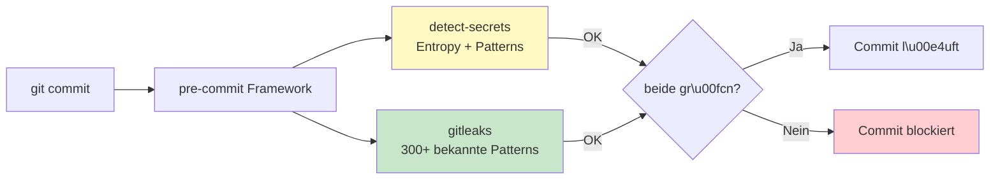

# 05 — Security- & Compliance-Checkliste

> **Leitprinzip:** Schutz ist mehrstufig — automatische Wächter laufen die ganze Zeit,
> die Freigabe-Checkliste prüfst du vor jedem Public-Going.
> Lieber 20 Minuten investieren als 6 Monate Reputation reparieren.

> **Letzte Überarbeitung:** Juni 2026 — nach Phase 6a (Audit-Log + DSGVO Art. 15/17)
> mit Praxis-Erfahrungen aus dem Live-Setup.

---

## 🚨 Die Anti-Disaster-Regeln

Diese drei Dinge passieren häufig — und sind jedes Mal vermeidbar:

1. **API-Key in Repo** — *passiert mindestens 1× pro Jahr bei Devs ohne Disziplin*
2. **Echte Kunden-Datei in `data/`** — *passiert wenn `.gitignore` nicht stimmt*
3. **Personenbezogene Daten in Test-Fixtures** — *passiert wenn man "schnell" testet*

Die Schutz-Mechanismen und die Checkliste unten verhindern genau diese Fälle.

---

## 📊 Status der Plattform (Stand: Juni 2026, Phase 6a)

| Bereich | Status |
|---|---|
| DSGVO Art. 15 (Auskunftsrecht) | ✅ Implementiert (`/admin/users/{id}/dsgvo-export`) |
| DSGVO Art. 17 (Vergessenwerden) | ✅ Implementiert mit Pseudonymisierung |
| Audit-Trail | ✅ 18 Action-Typen, Best-effort, mit IP-Adresse + Zeitstempel |
| EU AI Act Art. 13 (Transparenz) | ✅ Quellen-Pflicht in RAG implementiert |
| JWT-Auth | ✅ Mit konfigurierbarem Secret (Production-Validation) |
| HTTPS / TLS | ⏳ Lokal HTTP, geplant Phase 8 (Caddy/Traefik) |
| Rate-Limiting | ⏳ Geplant Phase 8 (slowapi) |
| 2FA | ⏳ Wishlist |
| Pentest | ⏳ Vor Produktivnutzung |

**Wichtig:** Diese Plattform ist **aktiv in Entwicklung**. Für Produktiv-Einsatz bei Kunden ist eine individuelle Härtung notwendig.

---

## 🛡️ Schutz-Mechanismen (in dieser Reihenfolge einrichten!)

Diese Mechanismen laufen **automatisch** — du musst nicht dran denken.

### Schutz-Schicht 1 — Pre-Commit-Hooks (lokal, vor jedem Commit)

**Konzept:** Zwei Wächter prüfen jeden Commit, bevor er entsteht. Wenn einer Alarm schlägt → Commit blockiert.



**Installation:**

```bash
# Im Projekt-Root, mit aktiviertem .venv
pip install pre-commit detect-secrets
brew install gitleaks
```

**`.pre-commit-config.yaml` im Projekt-Root anlegen:**

```yaml
repos:
  - repo: https://github.com/Yelp/detect-secrets
    rev: v1.5.0
    hooks:
      - id: detect-secrets
        args: ['--baseline', '.secrets.baseline']

  - repo: https://github.com/gitleaks/gitleaks
    rev: v8.21.2
    hooks:
      - id: gitleaks
```

> ⚠️ **YAML-Einrückung wichtig:** **2 Spaces, nicht 3, nicht Tab.** Bei Fehler:
> `cat > .pre-commit-config.yaml << 'EOF'` mit Heredoc nutzen.

**Aktivieren:**

```bash
detect-secrets scan > .secrets.baseline   # Baseline (was ist OK)
pre-commit install                          # Hook in .git/hooks aktivieren
pre-commit run --all-files                  # Erstes Probelauf gegen alle Dateien
```

**Erwartete Ausgabe:**

```
Detect secrets...........................................Passed
Detect hardcoded secrets.................................Passed
```

#### 🐛 Häufige Probleme + Lösungen

| Problem | Lösung |
|---|---|
| `InvalidConfigError: while parsing` | YAML-Einrückung mit 2 Spaces, kein Tab |
| `No such plugin to initialize` | `pre-commit autoupdate` — Hook-Versionen aktualisieren |
| `running in migration mode` | Harmlos — alter Hook wurde gesichert als `.legacy` |
| Funde in Tests/`.env.example` | False Positives → in `.secrets.baseline` aufnehmen oder `.gitleaks.toml` mit Allowlist |
| Befehl-Syntax mit `&&` schlägt fehl | Du nutzt vermutlich fish-Shell → Befehle einzeln ausführen |

#### 🔄 Maintenance — alle 3 Monate

```bash
pre-commit autoupdate                       # Hook-Versionen aktualisieren
detect-secrets scan > .secrets.baseline     # Baseline neu generieren
pre-commit run --all-files                  # Nachprüfen
```

### Schutz-Schicht 2 — GitHub Secret Scanning + Push Protection

**Konzept:** Selbst wenn lokale Hooks umgangen werden — GitHub-Server prüft jeden Push.

**Aktivieren:**

```
Repository → Settings → Code security
✅ Secret scanning
✅ Push protection (blockiert Pushes mit Secrets)
✅ Validity checks (prüft ob Key noch gültig)
```

Bei Erkennung: Push wird **blockiert** mit Hinweis. Du musst aktiv bestätigen oder den Key entfernen.

### Schutz-Schicht 3 — Dependabot

**Konzept:** Tägliches Scannen von `requirements.txt` / `package.json` auf bekannte Schwachstellen.

```
Repository → Settings → Code security
✅ Dependabot alerts
✅ Dependabot security updates (Auto-PRs für Patches)
✅ Dependency graph
```

### Schutz-Schicht 4 — Branch Protection (für Public-Repos)

```
Repository → Settings → Branches → Add branch protection rule
Branch name pattern: main
✅ Require a pull request before merging
✅ Require status checks to pass
✅ Require signed commits (optional, aber empfohlen)
```

### Schutz-Schicht 5 — CODEOWNERS-File für sensible Bereiche

In `.github/CODEOWNERS`:

```
# Sicherheitsrelevante Bereiche brauchen Sascha-Review
/app/auth/        @<dein-username>
/app/config.py    @<dein-username>
/app/api/admin.py @<dein-username>
*.env*            @<dein-username>
```

---

## 🔍 Freigabe-Checkliste vor jeder Veröffentlichung

> Drucke diese Liste aus oder hänge sie in dein Repo als `RELEASE-CHECKLIST.md`.
> Vor jedem `git push` zu einem Public-Repo: alle Punkte ✅.

### 🔑 Secrets & Credentials

- [ ] **Pre-commit-Hooks aktiv** (`detect-secrets` + `gitleaks`)
- [ ] **Keine API-Keys** im Code oder in Commit-Messages
- [ ] **`.env` ist in `.gitignore`** und wurde nie committet (auch nicht in Vergangenheit!)
- [ ] **`.env.example`** existiert mit Platzhaltern (`<DEIN_KEY_HIER>`)
- [ ] **Git-History gescannt** mit `gitleaks detect --no-banner`
- [ ] **Kein hard-coded Passwort** (auch nicht "test123" in Tests)
- [ ] **JWT-Secret** wird aus Environment gelesen, nicht im Code
- [ ] **Cloud-Zugangsdaten** (AWS, Azure, GCP) in keinen Files
- [ ] **TLS-Zertifikate / Private-Keys** (`.pem`, `.key`, `.crt`) nicht im Repo

### 📂 Daten

- [ ] **`data/` ist in `.gitignore`** mit Ausnahme `data/README.md`
- [ ] **Keine echten PDFs / DOCX / XLSX** im Repo — auch nicht "zum Testen"
- [ ] **`uploads/`, `documents/`, `chroma/`** sind ausgeschlossen
- [ ] **Datenbank-Dateien** (`*.db`, `*.sqlite`, `*.sqlite3`) ausgeschlossen
- [ ] **Backup-Dateien** (`*.bak`, `*.dump`) ausgeschlossen
- [ ] **Log-Dateien** (`*.log`, `logs/`) ausgeschlossen

### 🧑 Personenbezogene Daten (DSGVO)

- [ ] **Keine echten Namen** in Test-Fixtures (`Max Mustermann` OK)
- [ ] **Keine echten E-Mail-Adressen** (`@example.com` / `@example.org` nutzen, RFC 2606)
- [ ] **Keine echten Telefonnummern**
- [ ] **Keine echten Adressen** (außer fiktiven)
- [ ] **Keine echten Geburtsdaten**
- [ ] **Patientendaten / Mandantendaten / Steuerdaten:** NIEMALS
- [ ] **Mitarbeiter-Namen aus Kundenprojekten:** NIEMALS

### 🏢 Kundenbezogene Inhalte

- [ ] **Keine Kunden-Logos** ohne explizite Schriftform-Freigabe
- [ ] **Keine Kunden-Namen** in Repo-Namen, Commit-Messages, Issues
- [ ] **Keine Architektur-Diagramme mit Kunden-internen Systemen**
  (auch nicht "anonymisiert" — Branchen-Insider erkennen es)
- [ ] **Keine Source-Code-Snippets aus Kundenprojekten** (auch nicht "stark verändert")
- [ ] **Keine internen Email-Verteiler oder Slack-Channel-Namen**

### 📜 Lizenzen & Urheberrecht

- [ ] **Eigener Code:** Lizenz gewählt und in `LICENSE` gesetzt (MIT, Apache 2.0, CC BY 4.0)
- [ ] **Fremder Code:** Lizenz-kompatibel? Quelle in Datei-Header
- [ ] **Bilder / Grafiken:** Eigene oder lizenzfrei (Creative Commons, eigenes Werk)
- [ ] **Mermaid/PlantUML-Diagramme:** eigene Erstellung
- [ ] **Zitate** in Whitepaper: max. 15 Wörter pro Quelle, mit Verweis

### 🔧 Code-Qualität (für Public-Repos)

- [ ] **README** ist verständlich (auch ohne Vorwissen)
- [ ] **Setup-Anleitung** funktioniert auf frischem System
- [ ] **`requirements.txt` / `package.json`** ist aktuell
- [ ] **Keine TODO/FIXME** mit kritischen Hinweisen ("TODO: Auth fixen vor Prod")
- [ ] **Tests laufen grün** (zumindest die existierenden)
- [ ] **Keine `print("DEBUG: ...")`-Reste** im Code
- [ ] **`SECURITY.md`** vorhanden mit Disclosure-Pfad

### 📝 Metadaten & Konfiguration

- [ ] **Repo-Beschreibung** ist gesetzt (1-2 Zeilen)
- [ ] **Topics** sind sinnvoll (5-10, siehe `01-profil-strategie.md`)
- [ ] **License** ist im Repo-Header sichtbar
- [ ] **`README.md`** beginnt mit klarem Wertversprechen
- [ ] **Badges** sind aktuell (keine "Build: failing" wenn's grün ist)

---

## 💊 Pharma-Spezifische "NIEMALS-Liste"

Wenn du an Pharma-Kunden arbeitest, gelten zusätzliche Regeln. Diese **NIE im Repo** (auch nicht versteckt, auch nicht in Tests):

### Patient-bezogen (DSGVO Art. 9 — besondere Kategorien)

- ❌ Echte Patientennamen (auch in Test-Fixtures)
- ❌ Versicherungsnummern, Krankenkassendaten
- ❌ Diagnosen mit personenbezogenen Identifiern
- ❌ Verschreibungs- oder Therapie-Daten
- ❌ Real-World-Evidence-Daten ohne Anonymisierung
- ❌ Klinische Studiendaten ohne Freigabe

### Werbung / Vertrieb (HWG)

- ❌ Aussagen wie "bestes Medikament", "garantiert wirksam"
- ❌ Echte Produktnamen mit Werbeversprechen
- ❌ Vergleiche mit konkurrierenden Präparaten ohne wissenschaftlichen Beleg
- ❌ Patienten-Erfolgsgeschichten ohne dokumentierte Einwilligung
- ❌ Vorher-Nachher-Bilder

### Geschäftlich (FSA-Kodex)

- ❌ Apotheken-Listen mit Kontaktdaten
- ❌ Pharma-Berater-Routen oder -Pläne
- ❌ Konditionen, Rabatte, Bonusvereinbarungen
- ❌ Außendienst-Berichte zu konkreten Ärzten

### Pharmakovigilanz (AMG § 63b)

- ❌ Nebenwirkungs-Berichte ohne Anonymisierung
- ❌ UAW-Falldaten (Unerwünschte Arzneimittel-Wirkungen)

### Empfohlen: separate Branchen-Compliance-Datei

Für Pharma-Projekte: `docs/pharma-compliance.md` mit dieser Liste, plus konkretem Verfahren bei Versehen.

---

## 🛡️ Compliance-Themen im Detail

### DSGVO

| Was zu beachten | Wo prüfen | Status |
|---|---|---|
| Personenbezogene Daten in Beispielen? | Tests, Fixtures, README-Screenshots | Manuell prüfen |
| Cookie-Hinweise / Telemetrie aktiviert? | Streamlit-Config, Frontend-Skripte | ✅ Telemetrie aus |
| Audit-Log vorhanden? | `app/services/audit.py` | ✅ Implementiert |
| Pseudonymisierung bei Löschung? | `app/api/admin.py` | ✅ Implementiert |
| DSFA (Folgenabschätzung) erforderlich? | Nur für produktive Systeme | ⏳ Vor Produktiv |

### EU AI Act (gilt seit 2024)

| Was zu beachten | Konsequenz | Status |
|---|---|---|
| Klassifizierung des Systems (Risiko-Stufe)? | High-Risk → eigene Doku-Pflichten | ⏳ Pharma evtl. High-Risk |
| Transparenz-Pflicht (Art. 13) | RAG: Quellenangaben Pflicht | ✅ Implementiert |
| Human-Oversight-Anforderung | UI muss klar machen: KI-Antwort, nicht Faktenwahrheit | ✅ Disclaimer in Plugin |
| Logging für Auditierbarkeit | Token-Logs + Audit-Trail | ✅ Implementiert |

### BSI-Grundschutz (für Bundeswehr-nahe / öffentliche Auftraggeber)

| Empfehlung | Status |
|---|---|
| Verschlüsselung at-rest | ⏳ Phase 8 (PostgreSQL TDE) |
| Verschlüsselung in-transit | ⏳ Phase 8 (HTTPS via Caddy/Traefik) |
| Multi-Faktor-Auth | ⏳ Wishlist |
| Schlüsselverwaltung | ⏳ Phase 8 (JWT-Secret aus Vault) |
| Backup + Restore-Test | ⏳ Phase 8 |
| Pentest | ⏳ Vor Produktivnutzung |

---

## 🚒 Notfall-Plan: Secret ist doch leaked

Wenn du **nach** einem Push merkst, dass ein Secret im Repo gelandet ist:

### Schritt 1 — Sofort: Key rotieren

Beim Provider (Anthropic, GitHub, AWS, etc.) **sofort** neuen Key generieren und alten widerrufen. **Reihenfolge wichtig:** Erst rotieren, dann beruhigt aufräumen.

### Schritt 2 — Logs prüfen beim Provider

```
Anthropic Console → Usage → War der geleakte Key in den letzten X Stunden im Einsatz?
GitHub → Settings → Security Log → suspicious activity?
```

Wenn ja: **DSB-Meldepflicht in 72h prüfen** (DSGVO Art. 33).

### Schritt 3 — Git-History bereinigen

```bash
pip install git-filter-repo

# Bestimmte Datei aus History entfernen
git filter-repo --invert-paths --path .env

# Force-Push auf alle Branches
git push --force --all
git push --force --tags
```

### Schritt 4 — GitHub Support kontaktieren

GitHub kann auch **Caches und Forks** bereinigen:
- https://support.github.com/contact/private-information
- Issue eröffnen mit Repository-URL und Commit-Hash

### Schritt 5 — Vorfall dokumentieren

In `docs/incidents/YYYY-MM-DD-secret-leak.md`:
- Was war geleaked
- Wann entdeckt
- Was wurde gemacht (Rotation, Bereinigung)
- Hat es Schaden gegeben

→ Bei DSGVO-Verstoß: Pflicht.

> ⚠️ **Wichtig:** Ein Force-Push allein reicht NICHT. Caches, Forks und
> GitHubs eigene Archive können das Secret noch enthalten. Rotation ist Pflicht.

---

## ✅ Mini-Skript: Selbst-Audit eines Repos

```bash
#!/usr/bin/env bash
# Prüft ein Repo grob auf typische Probleme

set -e
REPO_PATH="${1:-.}"
cd "$REPO_PATH"

echo "🔍 Auditing: $(pwd)"

# Test 1: .env in gitignore?
if grep -q "^\.env$\|^\.env\.\*" .gitignore 2>/dev/null; then
    echo "  ✅ .env in .gitignore"
else
    echo "  ❌ .env NICHT in .gitignore"
fi

# Test 2: data/ in gitignore?
if grep -q "^data/$\|^data/" .gitignore 2>/dev/null; then
    echo "  ✅ data/ in .gitignore"
else
    echo "  ❌ data/ NICHT in .gitignore"
fi

# Test 3: pre-commit-hooks vorhanden?
if [ -f ".pre-commit-config.yaml" ]; then
    echo "  ✅ pre-commit-config vorhanden"
else
    echo "  ⚠️  .pre-commit-config.yaml fehlt"
fi

# Test 4: Secrets in History via gitleaks?
if command -v gitleaks &> /dev/null; then
    if gitleaks detect --no-banner --quiet 2>/dev/null; then
        echo "  ✅ gitleaks: keine Funde"
    else
        echo "  ⚠️  gitleaks: Funde in History (manuell prüfen!)"
    fi
else
    echo "  ℹ️  gitleaks nicht installiert (brew install gitleaks)"
fi

# Test 5: README + LICENSE + SECURITY vorhanden?
[ -f "README.md" ] && echo "  ✅ README.md" || echo "  ❌ README.md fehlt"
[ -f "LICENSE" ] && echo "  ✅ LICENSE" || echo "  ⚠️  LICENSE fehlt"
[ -f "SECURITY.md" ] && echo "  ✅ SECURITY.md" || echo "  ⚠️  SECURITY.md fehlt"

echo "🏁 Audit fertig. Manuelle Prüfung der ⚠️ und ❌ Punkte empfohlen."
```

Speichern als `~/bin/repo-audit.sh`, ausführbar machen mit `chmod +x`, dann:

```bash
repo-audit.sh ~/path/to/repo
```

---

## 🛠️ Shell-Hinweise (fish vs. bash)

Du nutzt vermutlich **fish-Shell** (Mac-Default seit macOS Catalina möglich). Manche Befehle aus Tutorials sind bash-Syntax und funktionieren in fish anders:

| Was | bash | fish |
|---|---|---|
| Mehrere Befehle verketten | `cmd1 && cmd2` | `cmd1; and cmd2` |
| Verzweigung | `cmd1 \|\| cmd2` | `cmd1; or cmd2` |
| Heredoc (`<< EOF`) | unterstützt | unterstützt, gleiche Syntax |
| Variable setzen | `VAR=value` | `set VAR value` |

**Faustregel:** Wenn ein Befehl mit `cmdand dquote>` oder ähnlichem hängt — `Ctrl+C` drücken und die Befehle **einzeln** ausführen.

---

## 🎯 Quick-Check vor jedem Push

Dieser 30-Sekunden-Check vor `git push`:

```bash
git status                                  # Was wird gepusht?
git diff --cached                           # Was sind die Änderungen?
gitleaks detect --no-banner --quiet         # Schnell-Scan
pre-commit run --all-files                  # Volltest
```

Wenn alles grün: pushen. Wenn nicht: **STOPP**.
