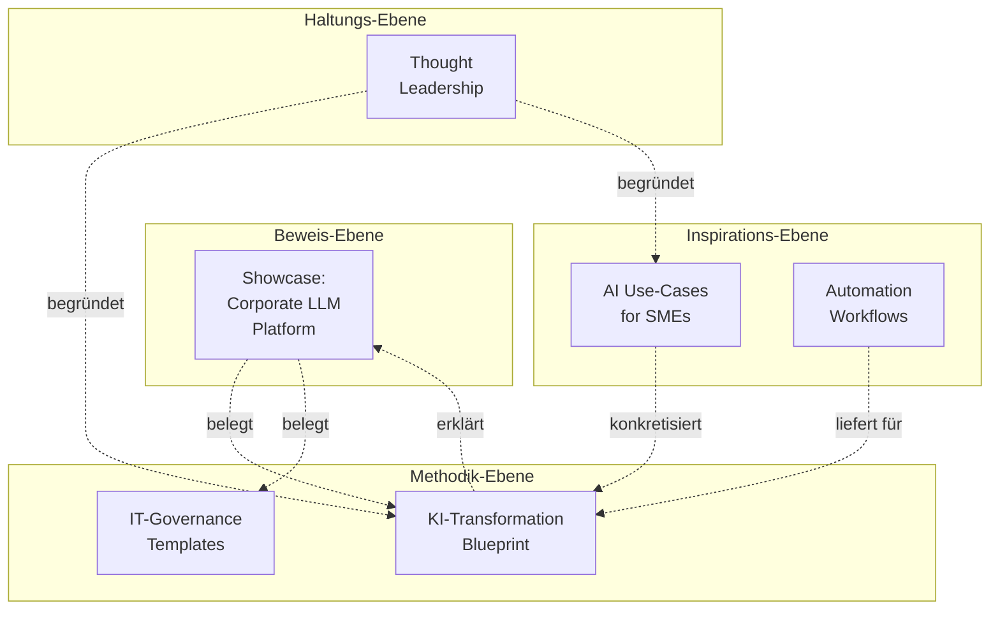

# 06 — Portfolio: 5 thematische Säulen

> **Leitprinzip:** Jedes Thema hat ein eigenes Nutzenversprechen, einen
> Elevator Pitch und eine Veröffentlichungsstrategie. So entsteht ein
> kohärentes Beratungs-Portfolio statt einer Repo-Sammlung.

---

## 1️⃣ KI-Transformations-Blueprint

### Nutzenversprechen
> *"Sie wissen nach 4 Wochen, wo Sie stehen und welcher KI-Use-Case sich
> für Sie rechnet — mit klarem Vorgehen statt Beraterbingo."*

### Elevator Pitch
*"Viele Mittelständler scheitern bei KI-Einführungen nicht an der Technik,
sondern an unklarem Vorgehen. Mein 5-Phasen-Blueprint bringt Sie in 4 Wochen
von "wir sollten was mit KI machen" zu "wir wissen, welcher Use-Case sich
rechnet" — inklusive Compliance-Check."*

### Zielgruppe
- Geschäftsführung KMU (20-500 MA)
- IT-Leiter ohne KI-Vorerfahrung
- Beratungsunternehmen, die KI-Service-Lines aufbauen

### Beispielprojekte
- Reifegrad-Assessment für mittelständische Steuerkanzlei
- Use-Case-Priorisierung für Energieversorger
- Build-vs-Buy-Entscheidung für Anwaltskanzlei

### Veröffentlichungsstrategie
- **Repo:** `ki-transformation-blueprint` (Public)
- **Trigger:** LinkedIn-Posts zu jedem Phasen-Artefakt
- **Monetarisierung:** Hochpreisig (Workshop ab 5-stellig); Templates sind Lead-Magnet

---

## 2️⃣ AI Use-Cases for SMEs

### Nutzenversprechen
> *"Sie sehen sofort, welche KI-Anwendung in Ihrer Branche realistisch
> Mehrwert bringt — mit ehrlichem Aufwand und Datenschutz-Vermerk."*

### Elevator Pitch
*"KI-Hype ist überall — aber konkrete, KMU-taugliche Use-Cases sind selten.
Meine kuratierte Sammlung zeigt, was in Handwerk, Pharma, Steuerberatung
und Co. wirklich funktioniert — branchenspezifisch, mit realistischem
Aufwand und Compliance-Ampel."*

### Zielgruppe
- KMU-Geschäftsführer in der Orientierungsphase
- Strategie-Berater, die schnell Use-Case-Inspiration brauchen
- IT-Leiter beim Brainstorming

### Beispielprojekte
- Pharma-Außendienst: HWG-konforme Vorbereitung (NIE Patientendaten!)
- Steuerberatung: DATEV-Buchungssatz-Vorschlag mit lokalem LLM
- Handwerk: KI-gestützte Angebotskalkulation

### Veröffentlichungsstrategie
- **Repo:** `ai-use-cases-sme` (Public)
- **Trigger:** 1 Use-Case / Woche als LinkedIn-Carousel + Repo-Update
- **Engagement-Hebel:** "Welcher Use-Case fehlt in deiner Branche?" → Pull-Requests willkommen

---

## 3️⃣ Automation Workflows

### Nutzenversprechen
> *"Sie sehen, dass Strategie und Umsetzung in einer Hand möglich sind —
> mit sofort einsetzbaren Bausteinen."*

### Elevator Pitch
*"Strategie-Berater reden viel über Automatisierung. Ich zeige konkret,
wie es geht — mit fertigen, sicheren n8n-Workflows, GitHub-Actions und
Shell-Skripten. Praktischer Code, nicht PowerPoint."*

### Zielgruppe
- IT-Leiter mit kleinem Team, viel zu tun
- Berater, die "hands-on"-Glaubwürdigkeit suchen
- Recruiter mit technischem Verständnis

### Beispielprojekte
- DSGVO-konforme E-Mail-Bereinigung (n8n)
- Python-Quality-Gate als GitHub-Actions-Reusable-Workflow
- Postgres-Backup-Script mit Restore-Test

### Veröffentlichungsstrategie
- **Repo:** `automation-workflows` (Public)
- **Frequenz:** 1 neuer Workflow / Monat
- **Engagement:** Demo-Videos auf LinkedIn

---

## 4️⃣ IT Governance Templates

### Nutzenversprechen
> *"Sie haben innerhalb eines Tages ein funktionierendes Governance-Setup
> — schlank genug für 50 Mitarbeiter, robust genug für ein Audit."*

### Elevator Pitch
*"IT-Governance scheitert oft an zwei Extremen: 'wir machen erstmal'
oder Enterprise-Frameworks für 50-Personen-Unternehmen. Meine KMU-tauglichen
Templates sind der Mittelweg — RACI, Demand-Backlogs, ADRs, DSGVO-VV —
sofort einsetzbar."*

### Zielgruppe
- IT-Leiter / CIO in KMU
- Compliance-Beauftragte
- Berater im Mandat (als Leitplanken-Toolbox)

### Beispielprojekte
- Demand-Board für 80-Personen-Industrieunternehmen
- DSGVO-Verarbeitungsverzeichnis für Pharma-Großhändler
- AI-Governance-Board-Charter für Energieversorger

### Veröffentlichungsstrategie
- **Repo:** `it-governance-templates` (Public)
- **Trigger:** Jedes Template hat einen LinkedIn-Begleitpost
- **Monetarisierung:** "Governance Light"-Workshop als Lead-Produkt

---

## 5️⃣ Thought Leadership

### Nutzenversprechen
> *"Sie sehen, wie ich denke — bevor wir reden."*

### Elevator Pitch
*"Beratung ohne Haltung ist Beliebigkeit. In datierten, mit Quellen
belegten Analysen positioniere ich mich zu den großen Fragen — EU AI Act,
Cloud-Souveränität, lokales LLM. Keine Marketing-Texte, sondern ehrliche,
kritische Einschätzungen."*

### Zielgruppe
- Entscheider, die wissen wollen, mit wem sie es zu tun haben
- Recruiter, die "Substanz" suchen
- Journalisten / Konferenz-Organisatoren

### Beispielthemen
- "EU AI Act für KMU — praktische Checkliste"
- "Lokales vs. Cloud-LLM: Entscheidungsmatrix"
- "Cloud-Souveränität: Hetzner, IONOS, STACKIT im Vergleich"

### Veröffentlichungsstrategie
- **Repo:** `thought-leadership` (Public)
- **Frequenz:** 1 Analyse / Monat (4500 Wörter max.)
- **Distribution:** LinkedIn-Lang-Post + Repo-Link + optional Newsletter
- **Wirkung:** Über 6-12 Monate → "Sascha hat zu X eine fundierte Position"

---

## 🧩 Wie die 5 Säulen zusammenhängen

**Wirkung beim Besucher:**
1. *"Hat tatsächlich gebaut"* (Showcase)
2. *"Weiß wie er vorgeht"* (Methodik)
3. *"Hat konkrete Ideen"* (Inspiration)
4. *"Hat eine Haltung"* (Thought-Leadership)

→ **Vertrauensgefüge ohne ein einziges Marketing-Wort.**

---

## 📊 Priorisierungs-Matrix

Welche Säule mit welchem Aufwand zuerst?

| Säule | Initial-Aufwand | Pflege-Aufwand | Hebel für Akquise | Empfehlung |
|---|---|---|---|---|
| Showcase | hoch (schon erledigt!) | mittel (Phase 5+) | sehr hoch | ✅ Phase 1 |
| KI-Transformation Blueprint | hoch (40-60 h) | niedrig | hoch | ✅ Phase 1 |
| IT-Governance Templates | mittel (20-30 h) | niedrig | mittel | ✅ Phase 1 |
| AI Use-Cases SME | niedrig (10h Skelett) | mittel (1 Use-Case/Mo) | mittel | ⏸️ Phase 2 |
| Automation Workflows | mittel (20-30 h) | mittel | niedrig | ⏸️ Phase 2 |
| Thought Leadership | hoch pro Artikel | hoch (1/Mo) | sehr hoch (langfristig) | ⏸️ Phase 2 |

**Empfehlung:** Phase 1 (erste 30 Tage) → Showcase + Blueprint + Governance.
Phase 2 (Tage 31-90) → die übrigen aufbauen.
