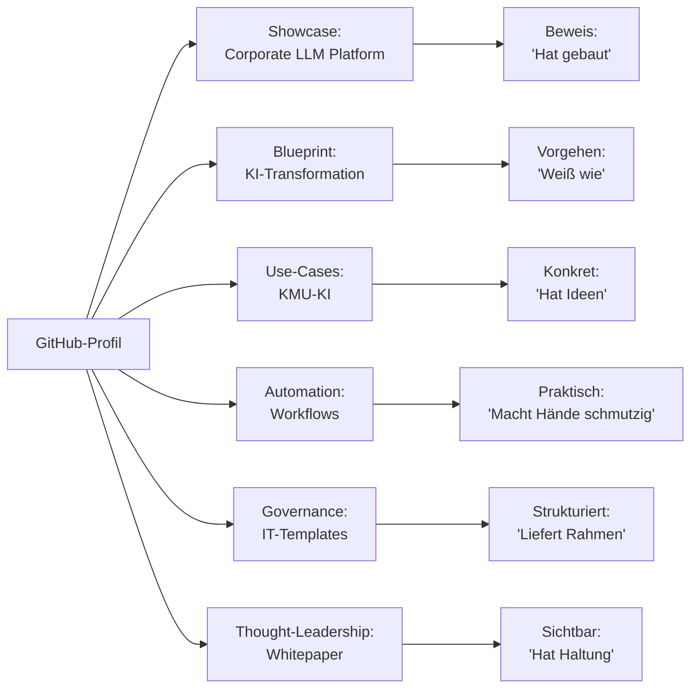

# 🎯 GitHub-Strategie: Sascha Kern — IT-Transformation & KI-Beratung

**Stand:** Juni 2026
**Zielgruppe:** Geschäftsführung, Unternehmer, Mittelstand, Beratungsfirmen,
Energieversorger, Öffentlicher Sektor, Bundeswehr-nahe Org., Recruiter

---

## 📌 Executive Summary

Diese Strategie verwandelt dein bereits bestehendes GitHub-Profil in eine
**Visitenkarte** für strategische IT- und KI-Beratung — nicht in eine
Entwickler-Vitrine. Drei tragende Säulen:

1. **Showcase-Repository** — die Corporate LLM Platform als Beweis
   ("Ich habe selbst gebaut, was ich anderen empfehle")
2. **Wissens-Repositories** — Blueprints, Templates, Whitepaper für
   wiederkehrende Strategie-Themen (KI-Transformation, IT-Governance)
3. **Saubere Trennung** zwischen öffentlich/Kunde/privat — Vertrauen
   durch sichtbare Governance

**Differenzierung:** Andere Berater zeigen Folien. Du zeigst Substanz.

---

## 📚 Inhaltsverzeichnis

| Aufgabe | Datei | Was drin ist |
|---|---|---|
| 1 | [01-profil-strategie.md](01-profil-strategie.md) | Profilbio, About-Sektion, Schlagwörter (DE + EN) |
| 2 | [02-repository-struktur.md](02-repository-struktur.md) | 6 angeheftete Repos mit Zweck, Zielgruppe, Inhalt |
| 3 | [03-repo-templates/](03-repo-templates/) | 6 fertige README-Vorlagen zum Übernehmen |
| 4 | [04-zugriffsmodell.md](04-zugriffsmodell.md) | Trennung Public / Customer / Private |
| 5 | [05-security-checkliste.md](05-security-checkliste.md) | Freigabe-Checkliste vor jedem Push |
| 6 | [06-portfolio.md](06-portfolio.md) | 5 Themen-Cluster mit Nutzenversprechen |
| 7 | [07-90-tage-plan.md](07-90-tage-plan.md) | Umsetzung Woche 1–12 |
| 8 | [08-kritische-bewertung.md](08-kritische-bewertung.md) | Risiken + Gegenmaßnahmen |

---

## 🎨 Positionierungs-Statement (Kurzform)

> **Sascha Kern.**
> *IT-Transformation Manager · KI-Berater · Brücken-Bauer zwischen
> Strategie und Implementierung.*
>
> *Ich helfe Geschäftsführungen, KI nicht nur zu planen, sondern messbar
> umzusetzen — unter strikter Beachtung von DSGVO, EU AI Act und BSI-Grundschutz.*

---

## 🧭 Die "Pinned 6" auf einen Blick

Jeder Pin adressiert einen anderen Aspekt deiner Glaubwürdigkeit. Zusammen
bilden sie ein **Beratungs-Portfolio**, kein Coding-Portfolio.

---

## ⚠️ Was diese Strategie NICHT ist

- ❌ **Kein Anspruch auf Vollständigkeit** — Phase 1 reicht ein guter Showcase
- ❌ **Kein "fake it till you make it"** — was nicht eigene Erfahrung ist, kommt nicht rein
- ❌ **Kein Recruiter-Lockmittel** — Recruiter sind Nebenprodukt, nicht Zweck
- ❌ **Kein Ersatz für Vertrieb** — GitHub ist Vertrauens-Anker, kein Akquise-Kanal

---

## 🚦 Empfehlung für den Start

Wenn du **morgen** anfangen willst, beginne mit drei Dingen aus dem 90-Tage-Plan:

1. **Profil-Bio + About-Sektion** ([01-profil-strategie.md](01-profil-strategie.md))
2. **Corporate LLM Platform** als ersten Pin sauber readme'n
   ([Template hier](03-repo-templates/06-corporate-llm-platform.md))
3. **Security-Checkliste** durchgehen, bevor irgendetwas öffentlich wird
   ([05-security-checkliste.md](05-security-checkliste.md))

Der Rest folgt iterativ. **Lieber 2 hervorragende Repos als 6 mittelmäßige.**
