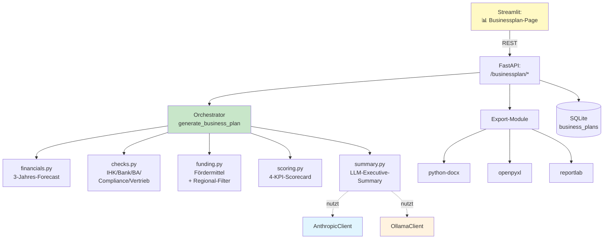

# Phase 5 — Businessplan-Generator

**Ziel:** Branchenübergreifender Businessplan-Generator als
**Grundkomponente** unserer Plattform — für jeden User verfügbar,
ohne Zusatzkosten, mit Word/Excel/PDF-Export.

---

## 🎯 Was neu ist

Inspiriert durch das **Verinaris MVP** (eigenständige Streamlit-App), aber
**vollständig in unsere Architektur** integriert:

- ✅ Provider-Abstraktion: Cloud (Claude) **oder** lokal (Ollama)
- ✅ JWT-Auth + Rollen (Admin sieht alle Pläne, User nur eigene)
- ✅ Zentrale DB statt eigener SQLite
- ✅ Token-Tracking funktioniert automatisch
- ✅ Branchen-Vorlagen-System (KMU + Verinaris-Beispiel, erweiterbar)
- ✅ Word/Excel/PDF-Export
- ✅ Regional-Filter für Fördermittel (DE, RP, BY, BW, NRW, ...)
- ✅ 19 Tests grün

---

## 🏗️ Architektur



---

## 📁 Code-Struktur

```
app/services/businessplan/
├── __init__.py                  # Orchestrator: generate_business_plan()
├── models.py                    # Pydantic-Schemas + SQLModel
├── financials.py                # 3-Jahres-Forecast (regelbasiert)
├── checks.py                    # Härtungs-Checks (5 Bereiche)
├── funding.py                   # Fördermittel mit Regional-Filter
├── scoring.py                   # 4-KPI-Score-Berechnung
├── summary.py                   # LLM-Summary mit Provider-Abstraktion
├── templates/
│   ├── __init__.py              # Template-Registry
│   ├── kmu_default.py           # KMU Standard
│   └── verinaris.py             # Verinaris als Beispiel
└── export/
    ├── docx_exporter.py         # Word-Export
    ├── xlsx_exporter.py         # Excel-Export (4 Sheets)
    └── pdf_exporter.py          # PDF-Export (Executive Summary)

app/api/businessplan.py          # 10 REST-Endpoints

streamlit_app/views/businessplan_page.py   # UI mit 2 Tabs
streamlit_app/api_client.py                # 9 Client-Methoden

tests/test_businessplan.py       # 19 Tests
```

---

## 🚀 Endpoints

| Methode | Pfad | Was es macht |
|---|---|---|
| GET | `/businessplan/templates` | Alle Vorlagen |
| GET | `/businessplan/templates/{id}/default` | Default-Werte einer Vorlage |
| POST | `/businessplan/generate?llm_model=...` | Plan berechnen (preview) |
| POST | `/businessplan?last_score=N` | Plan speichern |
| GET | `/businessplan` | Eigene Pläne (Admin: alle) |
| GET | `/businessplan/{id}` | Einzelner Plan |
| PUT | `/businessplan/{id}` | Plan aktualisieren |
| DELETE | `/businessplan/{id}` | Plan löschen |
| POST | `/businessplan/export/docx` | Word-Download |
| POST | `/businessplan/export/xlsx` | Excel-Download |
| POST | `/businessplan/export/pdf` | PDF-Download |

---

## 💡 Vorteile gegenüber Verinaris-MVP

| Was | Verinaris-MVP | Unsere Lösung |
|---|---|---|
| **LLM** | Nur Ollama, hardcoded | Cloud (Claude) ODER lokal — User wählt |
| **Architektur** | Single-File 514 Zeilen | Modular, ~10 Dateien à 100-200 Zeilen |
| **Auth** | Eigene bcrypt-Logik | Plattform-JWT mit Rollen |
| **DB** | Eigene SQLite | Zentrale DB |
| **Generizität** | Verinaris hardcoded | Template-System mit beliebig vielen Branchen |
| **Tests** | ❌ keine | ✅ 19 Tests |
| **Fördermittel** | Statisch, keine Region | Mit Regional-Filter (RP, BY, BW, NRW) |
| **Ollama-API** | Altes `/api/generate` | Modernes `/api/chat` mit Token-Counts |
| **Token-Tracking** | ❌ kein | ✅ EUR-Anzeige (Cloud), 0€ (lokal) |

---

## 🎨 UI-Workflow

1. **Tab: ✏️ Neuer / Bearbeiten**
   - Vorlage wählen (Dropdown: KMU Standard, Verinaris-Beispiel, ...)
   - Daten eingeben (vorbefüllt mit Vorlage)
   - LLM-Toggle (sensible Daten → lokales Modell)
   - **🔢 Berechnen** → Score, Summary, Finanzmodell, Checks, Fördermittel
   - **💾 Speichern** + **📄 Word** + **📊 Excel** + **📑 PDF**

2. **Tab: 💾 Gespeicherte Pläne**
   - Liste aller eigenen Pläne (Admin: aller User)
   - **📂 Laden** → bearbeitet werden
   - **🗑** → löschen

---

## 🧩 Branchen-Vorlagen erweitern

Neue Vorlage in 3 Schritten:

```python
# 1. Datei anlegen: app/services/businessplan/templates/pharma.py
from app.services.businessplan.models import BusinessPlanInput, TemplateInfo

INFO = TemplateInfo(
    id="pharma",
    name="Pharma-Vertrieb",
    description="...",
    industry="pharma",
    is_example=False,
)

def get_default_input() -> BusinessPlanInput:
    return BusinessPlanInput(
        startup_name="...",
        # branchen-spezifische Defaults
    )
```

```python
# 2. In templates/__init__.py registrieren:
from app.services.businessplan.templates import kmu_default, pharma, verinaris

_TEMPLATES: dict = {
    kmu_default.INFO.id: (kmu_default.INFO, kmu_default.get_default_input),
    pharma.INFO.id: (pharma.INFO, pharma.get_default_input),    # ← NEU
    verinaris.INFO.id: (verinaris.INFO, verinaris.get_default_input),
}
```

```python
# 3. Tests in tests/test_businessplan.py ergänzen
```

→ Erscheint sofort im Dropdown der UI.

---

## 🛡️ Compliance-Hinweise

- ✅ **Disclaimer auf jedem Export** ("Keine Steuer-/Rechts-/Förderberatung")
- ✅ **Audit-fähig**: jeder Plan ist mit `user_email`, `created_at`, `updated_at` versehen
- ✅ **Datenschutz**: bei Wahl eines lokalen Modells (Ollama) verlassen die
   Plan-Daten den Server nicht
- ✅ **Fördermittel-Hinweis**: jede Fördermittel-Anzeige enthält
   "tagesaktuell prüfen"-Hinweis

---

## 🧪 Tests

```bash
pytest tests/test_businessplan.py -v
# → 19 passed

pytest tests/ -q
# → 107 passed, 1 skipped (alle alten + neuen)
```

Test-Abdeckung:
- Templates (4 Tests)
- Finanzberechnung (3 Tests)
- Härtungs-Checks (3 Tests)
- Fördermittel + Regional-Filter (3 Tests)
- Scoring (2 Tests)
- Orchestrator (1 Test)
- Exports DOCX/XLSX/PDF (3 Tests)

---

## 🗺️ Roadmap (was später kommt)

- [ ] 🟡 Weitere Branchen-Vorlagen: Pharma, Steuer, Anwalt, Energie
- [ ] 🟢 RAG-Integration: Marktanalyse-Sammlung automatisch verlinken
- [ ] 🟢 Plan-Versionierung: alte Stände behalten beim Update
- [ ] 🟢 Vergleichs-Modus: 2-3 Pläne nebeneinander
- [ ] 🟢 Fördermittel-DB mit URL-Fetcher (täglich aktualisiert)
- [ ] ⚪ Live-Charts in Streamlit (statt nur Tabellen)
