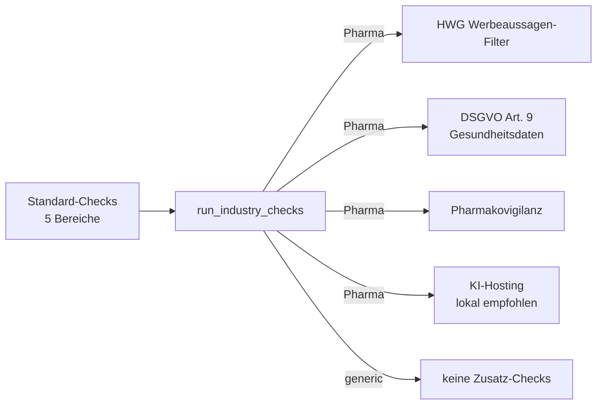

# Phase 5b — Pharma-Vorlage für Businessplan

**Ziel:** Erste branchen-spezifische Vorlage. Zeigt, wie das Template-System
mit zusätzlichen Industry-Checks und -Fördermitteln zusammenspielt.

---

## 🎯 Was neu ist

### Pharma-Template "Pharma-Beratung & Vertrieb"
- Realistische Defaults für eine Beratungs-/Vertriebs-Boutique (3-15 MA)
- Höhere Preise + längere Sales-Zyklen (6 Kunden in Jahr 1)
- Compliance-Tiefe "Mittel" — Begriffe und Rahmen, keine Paragrafen

### Industry-Checks (4 zusätzliche Pharma-Prüfungen)



| Check | Was er prüft |
|---|---|
| **HWG-Werbeaussagen** | Sucht in USP/Mission/Lösung nach Superlativen ("beste", "garantiert", "heilt") |
| **DSGVO Art. 9** | Erkennt Gesundheitsdaten-Bezug in Zielgruppe; prüft ob Art. 9 im Compliance-Status erwähnt |
| **Pharmakovigilanz** | Prüft ob Meldepflichten/BfArM/PEI im Plan adressiert sind |
| **KI-Hosting** | Wenn patientennahe Daten: empfiehlt lokales LLM (Ollama-Stack) |

### Pharma-Fördermittel (3 zusätzliche Programme)

- **KMU-innovativ: Medizintechnik (BMBF)**
- **ZIM (BMWK)**
- **go-digital (BMWK)** — als BAFA-anerkannter Berater

### Architektur-Änderung
- Neues Feld `BusinessPlanInput.industry` (vom Template gesetzt)
- Neue Funktion `run_industry_checks(p, financials)` — dispatcht nach Branche
- `find_funding_matches(p)` berücksichtigt jetzt auch `industry`
- Orchestrator kombiniert: `generic_checks + industry_checks`

---

## 🧪 Tests

```bash
pytest tests/test_businessplan.py -v
# → 29 passed
```

Neue Tests (10):
- Pharma-Template Registry
- Pharma-Template hat industry-Feld
- Pharma-Pricing höher als KMU
- Industry-Checks laufen für Pharma
- Industry-Checks leer für generic
- HWG-Filter Detection (positiv/negativ)
- HWG-Check triggert auf Superlative
- Pharma-Funding enthält Industry-Programme
- KMU-Funding enthält KEINE Pharma-Programme
- End-to-End: generic + industry Checks kombiniert

---

## 🎨 UI-Verhalten

Im Streamlit:
1. **📊 Businessplan** → Tab **✏️ Neuer**
2. Vorlage-Dropdown zeigt jetzt 3 Optionen:
   - KMU Standard (generic)
   - **Pharma-Beratung & Vertrieb (pharma_beratung_vertrieb)** ← NEU
   - Verinaris (Beispiel) (ki_consulting)
3. **🔄 Vorlage laden** → Formular vorbefüllt mit Pharma-Defaults
4. **🔢 Berechnen** → in der Härtungs-Check-Tabelle erscheinen **zusätzliche** Pharma-Zeilen:
   - "Pharma · HWG"
   - "Pharma · DSGVO Art. 9"
   - "Pharma · Pharmakovigilanz"
   - "Pharma · KI-Hosting" (falls patientennaher Kontext)
5. **Fördermittel** enthalten zusätzlich "KMU-innovativ: Medizintechnik", "ZIM", "go-digital"

---

## 🧩 Wie weitere Branchen ergänzt werden

Lass uns als Beispiel "Anwaltskanzlei" hinzufügen — 4 Schritte:

### 1. Template anlegen
`app/services/businessplan/templates/anwaltskanzlei.py` mit `INFO` + `get_default_input()`.

### 2. Im Registry registrieren
In `templates/__init__.py`:
```python
from app.services.businessplan.templates import (
    anwaltskanzlei,   # NEU
    kmu_default,
    pharma_beratung_vertrieb,
    verinaris,
)

_TEMPLATES = {
    ...,
    anwaltskanzlei.INFO.id: (anwaltskanzlei.INFO, anwaltskanzlei.get_default_input),
}
```

### 3. Industry-Checks ergänzen (optional)
In `industry_checks.py`:
```python
def _check_anwaltskanzlei(p, financials):
    # Mandant-Mandant-Trennung, BORA, ...
    return [...]

def run_industry_checks(p, financials):
    industry = (p.industry or "generic").lower()
    if industry == "pharma_beratung_vertrieb":
        return _check_pharma(p, financials)
    if industry == "anwaltskanzlei":         # NEU
        return _check_anwaltskanzlei(p, financials)
    return []
```

### 4. Industry-Fördermittel ergänzen (optional)
In `funding.py`:
```python
_INDUSTRY_PROGRAMS = {
    "pharma_beratung_vertrieb": [...],
    "anwaltskanzlei": [...],   # NEU
}
```

→ Erscheint sofort im UI-Dropdown, läuft mit allen Tests, fertig.

---

## 🛡️ Compliance-Position

**Wichtig:** Die Industry-Checks sind **Bewusstseins-Prüfungen**, keine
juristischen Tests. Sie ersetzen weder Anwalt noch DSB noch Compliance-Audit.

Auf jedem Export-Disclaimer:
> *"Dieses Dokument ersetzt keine Steuer-, Rechts- oder Fördermittelberatung."*

Bei jedem HWG-Check, der grün ist, kommt der Hinweis:
> *"Vor Markteinführung: jede Werbeaussage einzeln gegen HWG, AMG (Zulassungsbezug) und FSA-Kodex prüfen lassen."*
