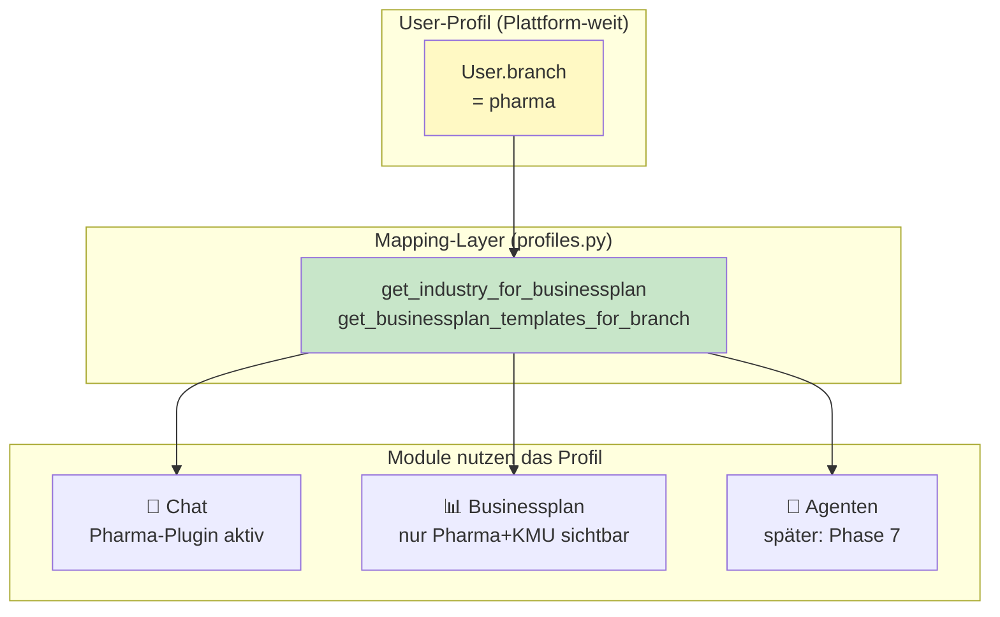

# Phase 5c — Branchen-Profile als 1. Klasse Bürger

**Ziel:** Saubere Trennung zwischen **User-Branche** (Plattform-weit) und
**Businessplan-Vorlage** (modul-spezifisch). Vorbereitung für Phase 7 (Agenten).

---

## 🎯 Problem, das wir gelöst haben

**Vorher:**
- Branchen-Logik war in `BusinessPlanInput.template_id` versteckt
- Pharma-Vorlage erschien NUR im Businessplan-Editor
- Nicht-Pharma-User sahen Pharma-Vorlage trotzdem
- Keine UI um die User-Branche zu wechseln

**Nachher:**
- `User.branch` ist **zentraler Schalter** der Plattform
- Eigene API: `GET/PUT /profile/me/branch`
- Sidebar zeigt aktuelles Profil mit Wechsel-Möglichkeit
- Businessplan-Vorlagen sind nach User-Branche **gefiltert**

---

## 🏗️ Architektur



---

## 📁 Neue Dateien

```
app/branches/profiles.py           # Zentrales Mapping-Modul
app/api/profile.py                  # GET/PUT /profile/me/branch
tests/test_branch_profiles.py       # 13 Tests
```

---

## 🔌 API

| Endpoint | Was | Zugriff |
|---|---|---|
| `GET /profile/industries` | Alle Branchen | Eingeloggt |
| `GET /profile/me` | Eigenes Profil + Branche | Eingeloggt |
| `PUT /profile/me/branch` | Branche wechseln | Eingeloggt |

**Templates-Filter:**
- `GET /businessplan/templates` filtert nach `User.branch`
- Admin sieht alle Vorlagen (Override)

---

## 🧩 Erweiterung um neue Branche (3 Schritte)

### 1. Enum erweitern (`app/models.py`)
```python
class UserBranch(str, Enum):
    GENERIC = "generic"
    PHARMA = "pharma"
    LEGAL = "legal"   # NEU
```

### 2. Profil definieren (`app/branches/profiles.py`)
```python
_PROFILES["legal"] = IndustryProfile(
    code="legal",
    name="Anwaltskanzlei",
    short_name="Anwalt",
    icon="⚖️",
    description="...",
)

# Mapping zum Businessplan
_BRANCH_TO_BP_INDUSTRY["legal"] = "anwaltskanzlei"
_BRANCH_TO_BP_TEMPLATES["legal"] = {
    "anwaltskanzlei", "kmu_default",
}
```

### 3. Tests + ggf. Plugin (`app/branches/legal/plugin.py`)

→ Sidebar zeigt automatisch die neue Option. Pharma-User-Workflow bleibt unverändert.

---

## 🧪 Tests (130 total)

- 13 neue Tests speziell für Branchen-Profile
- Mapping-Konsistenz: alle Template-Verweise existieren wirklich
- Backward-compat: bestehende User mit `branch="pharma"` arbeiten weiter

---

## ✨ Was der Kunde sieht

**Sidebar (neu):**

```
🏢 Mein Branchen-Profil
[💊 Pharma-Beratung & Vertrieb ▾]

💊 Pharma-Mode aktiv
  Chat folgt HWG/AMG-Regeln.
  Businessplan-Vorlagen + Industry-Checks
  für Pharma sichtbar.
```

**Im Businessplan-Generator:**
- Pharma-User sieht: Pharma-Vorlage + KMU-Standard (Fallback)
- Generic-User sieht: KMU-Standard + Verinaris-Beispiel (kein Pharma!)
- Admin sieht: alle Vorlagen

---

## 🚀 Vorbereitung für Phase 7 (Agenten)

Wenn wir später Agent-Vorlagen einführen, brauchen wir nur:

```python
# in profiles.py
_BRANCH_TO_AGENTS["pharma"] = {
    "regulatorik_watcher_pharma",
    "sop_writer_pharma",
    "marketing_drafts_pharma",
}
```

→ Pharma-User sieht in der Agenten-Übersicht nur die für ihn relevanten —
keine generischen Marketing-Agenten, keine Anwalts-Werkzeuge. **Sauber.**
