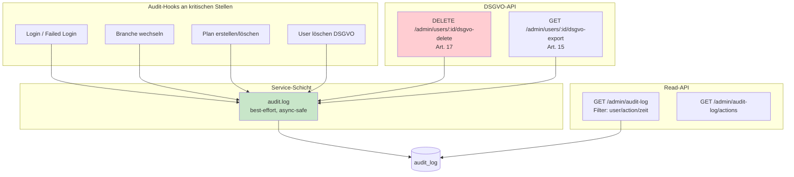
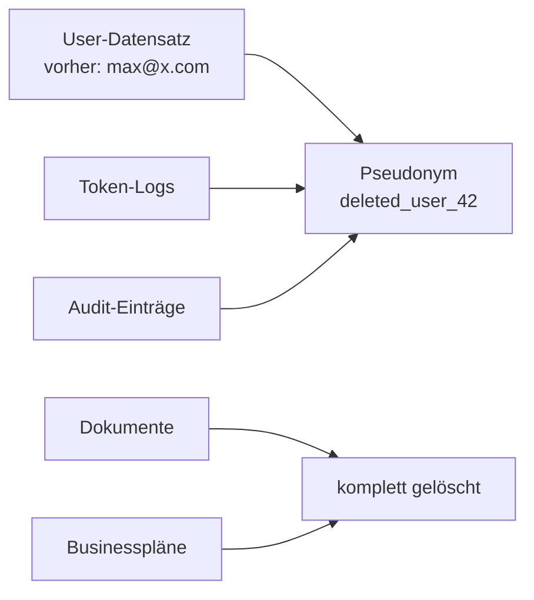

# Phase 6a — Compliance: Audit-Log + DSGVO

**Ziel:** Verkaufs-Voraussetzung für regulierte Branchen schaffen.
Pharma-/Steuer-/Anwalts-DSBs erwarten Audit-Trail + DSGVO Art. 17.

---

## 🎯 Was neu ist

✅ **Zentrales Audit-Log** mit 18 Action-Typen (Login, Branche-Wechsel, Plan-Aktionen, ...)
✅ **Audit-Hooks** in Login, Branchen-Wechsel, Businessplan-Save/Delete
✅ **Audit-Lesen + Filter** für Admin und Compliance-Officer
✅ **DSGVO Art. 17** — User-Löschung mit Pseudonymisierung
✅ **DSGVO Art. 15** — Datenexport-Endpoint
✅ **Streamlit-Page "🛡️ Admin / Compliance"** mit 3 Tabs
✅ **16 neue Tests** — gesamt **146 grün**

---

## 🏗️ Architektur



---

## 🔐 DSGVO-Strategie bei Art. 17

**Das Spannungsfeld:** "Recht auf Vergessenwerden" vs. gesetzliche Aufbewahrungspflicht
(z.B. 10 Jahre Pharma/Steuer).

**Unsere Lösung:**



**Was wird gelöscht:**
- E-Mail, Passwort-Hash (User-Datensatz)
- Alle Dokumente (Document-Tabelle)
- Alle Businesspläne (business_plans-Tabelle)

**Was bleibt pseudonymisiert:**
- Token-Logs (Kostenkontrolle, gesetzliche Anforderungen)
- Audit-Trail (10 Jahre Aufbewahrung)
- User-Datensatz selbst (Foreign-Keys bleiben gültig, `is_active=False`)

**Audit dokumentiert die Löschung:**
Ein neuer `USER_FULL_DELETE`-Eintrag dokumentiert wer wann wen gelöscht hat.
Der löschende Admin steht als User drin — der gelöschte User als Pseudonym
im `target_id`.

---

## 📦 Endpoints

### Audit-Log

| Methode | Pfad | Wer | Was |
|---|---|---|---|
| GET | `/admin/audit-log` | Admin + Compliance | Liste mit Filtern (user/action/zeit/limit) |
| GET | `/admin/audit-log/actions` | Admin + Compliance | Liste verfügbarer Action-Typen |

### DSGVO

| Methode | Pfad | Wer | Was |
|---|---|---|---|
| GET | `/admin/users/{id}/dsgvo-export` | Nur Admin | Art. 15 Auskunftsrecht |
| DELETE | `/admin/users/{id}/dsgvo-delete` | Nur Admin | Art. 17 Vergessenwerden |

---

## 🛡️ Audit-Hooks aktuell eingebaut

| Modul | Aktion | Stelle |
|---|---|---|
| Auth | `LOGIN` (success) | `app/api/auth.py` Login-Endpoint |
| Auth | `LOGIN_FAILED` (wrong password, inactive) | `app/api/auth.py` |
| Profile | `BRANCH_CHANGED` | `app/api/profile.py` |
| Businessplan | `PLAN_CREATED` | `app/api/businessplan.py` `save_plan` |
| Businessplan | `PLAN_DELETED` | `app/api/businessplan.py` `delete_plan` |
| Admin | `USER_FULL_DELETE` | `app/api/admin.py` |
| Admin | `USER_DATA_EXPORT` | `app/api/admin.py` |

**Künftig (TODO Phase 6b):**
- `DOCUMENT_UPLOADED` / `DOCUMENT_DELETED`
- `CHAT_QUERY` (mit Modell + Token-Count)
- `COLLECTION_CREATED` / `COLLECTION_DELETED`
- `PLAN_UPDATED` / `PLAN_EXPORTED`

---

## 🧪 Tests (146 total, +16 neu)

- Service: schreiben, JSON-Serialisierung, best-effort bei DB-Fehler
- Login-Hook: success + failure
- Zugriffsschutz: 403 für normale User
- Filter: nach Action, ungültige Action → 400
- DSGVO-Lösch-Selbstschutz: Admin kann sich nicht selbst löschen
- Unbekannter User → 404
- **Pseudonymisierung funktioniert**: alte E-Mail → Pseudonym überall
- Export liefert vollständige User-Daten

---

## 🎨 UI-Verhalten

**Sidebar (für Admin / Compliance-Officer):**

```
📚 Wissensbibliothek (nur Admin/Compliance)
🛡️ Admin / Compliance (nur Admin/Compliance) ← NEU
```

**Auf der Admin-Page:**

- **Tab "📜 Audit-Log"**: Filter (User-E-Mail, Action, Limit) + Tabelle
- **Tab "🗑 DSGVO Art. 17 — Löschen"** (nur Admin): User-ID + Bestätigungs-Phrase
- **Tab "📥 DSGVO Art. 15 — Export"** (nur Admin): User-ID + JSON-Anzeige + Download

---

## 🚀 Was als nächstes (Phase 6b/6c)?

- **Token-/Kosten-Charts** im Verbrauchs-Tab (Marketing-Wert)
- **CSV-/Excel-Export** der Token-Daten
- **Weitere Audit-Hooks** (Documents, Chat, Collections)
- **Automatische Retention-Policy** für Audit-Log (10 Jahre)
- **Anomalie-Detection** (z.B. 5x failed login → Alert)
