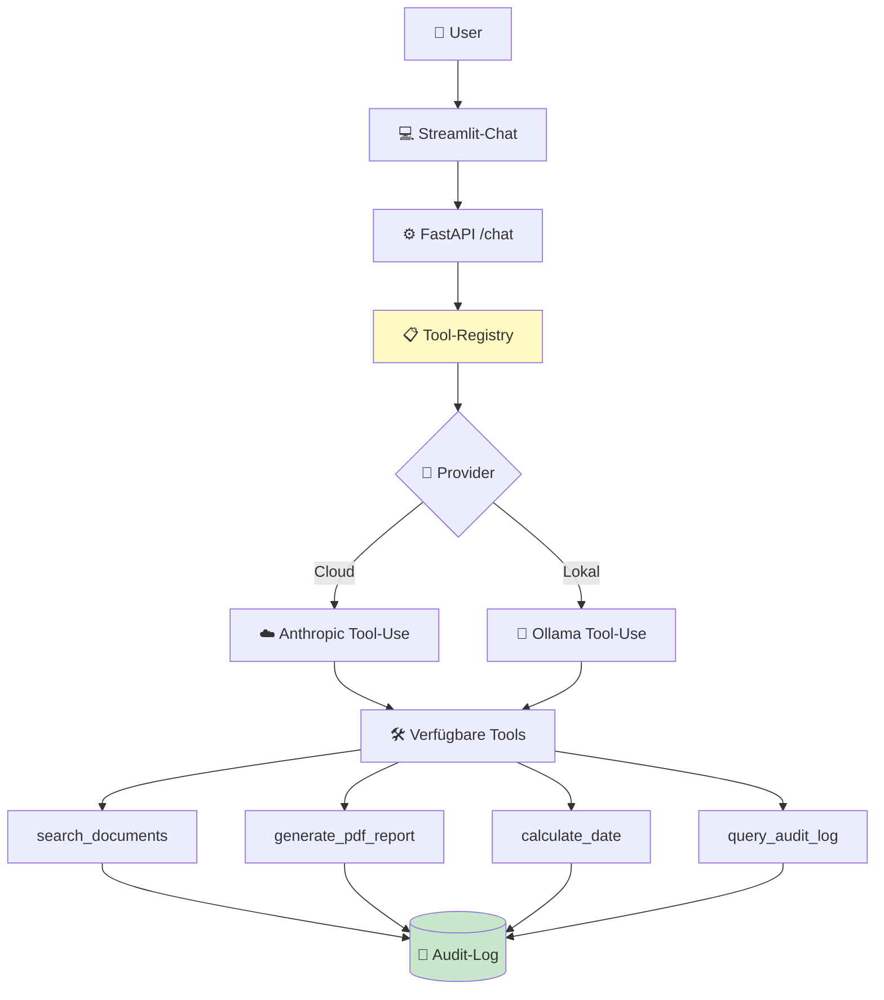
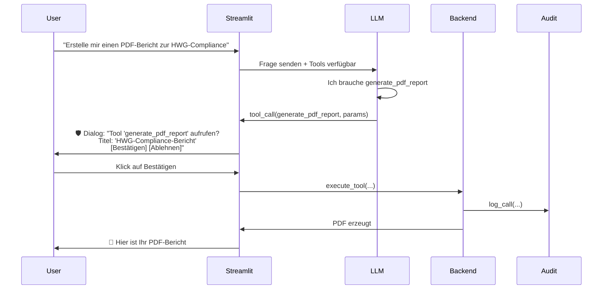

# 🤖 Phase 7a — Architektur-Skizze: Tool-Use-Grundlage

**Stand:** Juni 2026
**Autor:** Sascha Kern + Claude (Sparring)
**Status:** Konzept-Skizze (noch nicht implementiert)
**Ziel:** Verinaris von "Chatbot mit RAG" zu "Assistent mit Werkzeugen"

---

## 🎯 Was ist Tool-Use überhaupt?

**Heute (ohne Tool-Use):**
```
User fragt → LLM antwortet aus seinem Wissen
```

**Mit Tool-Use:**
```
User fragt → LLM erkennt: "Ich brauche aktuelle Daten / etwas berechnen"
          → LLM ruft Tool auf (z.B. search_documents)
          → Tool liefert Daten
          → LLM antwortet mit den Tool-Ergebnissen
```

**Analogie:** Ein Praktikant mit Telefonbuch, der bei Bedarf anruft, statt nur aus dem Kopf zu antworten.

---

## 🏗️ Architektur-Übersicht



**Kern-Idee:** Jedes Tool wird in der Registry deklariert, alle Tool-Aufrufe landen im Audit-Log.

---

## 🧩 Komponente 1: Tool-Registry mit BaseTool

### Konzept

Jedes Tool ist eine Python-Klasse, die von `BaseTool` erbt. Die Registry sammelt alle verfügbaren Tools und entscheidet, welche dem LLM zur Verfügung stehen (je nach User-Rolle, Branche, etc.).

### Pseudocode

```python
# app/tools/base.py
from abc import ABC, abstractmethod
from pydantic import BaseModel

class ToolParameters(BaseModel):
    """Basis für Tool-Parameter-Validierung."""
    pass

class BaseTool(ABC):
    """Basis-Klasse für alle Tools."""

    name: str                          # Eindeutiger Name
    description: str                   # Wofür ist das Tool?
    parameters_schema: dict            # JSON-Schema für Parameter
    requires_human_oversight: bool     # HiL nötig?
    allowed_roles: list[str]           # Welche Rollen dürfen?

    @abstractmethod
    def execute(self, params: dict) -> dict:
        """Führt das Tool aus."""
        pass

    def log_call(self, user_id: int, params: dict, result: dict):
        """Schreibt Aufruf ins Audit-Log."""
        # → Verwendet vorhandene audit.py aus Phase 6a
        pass
```

### Tool-Registry

```python
# app/tools/registry.py
class ToolRegistry:
    """Verwaltet alle verfügbaren Tools."""

    _tools: dict[str, BaseTool] = {}

    @classmethod
    def register(cls, tool: BaseTool):
        cls._tools[tool.name] = tool

    @classmethod
    def get_for_user(cls, user) -> list[BaseTool]:
        """Gibt Tools zurück, die der User nutzen darf."""
        return [
            tool for tool in cls._tools.values()
            if user.role in tool.allowed_roles
        ]

    @classmethod
    def execute(cls, name: str, params: dict, user) -> dict:
        """Führt Tool aus mit Berechtigungsprüfung + Audit-Log."""
        tool = cls._tools.get(name)
        if not tool:
            raise ToolNotFoundError(name)
        if user.role not in tool.allowed_roles:
            raise PermissionDeniedError(name, user.role)

        result = tool.execute(params)
        tool.log_call(user.id, params, result)
        return result
```

→ **Wichtig:** Audit-Log wird **automatisch** geschrieben — keine Tool-Implementation muss daran denken.

---

## 🧩 Komponente 2: Provider-Abstraktion

### Problem

Anthropic Claude und Ollama haben **unterschiedliche Tool-Use-APIs**:

```
Anthropic:  tools=[{"name": "...", "input_schema": {...}}]
Ollama:     tools=[{"type": "function", "function": {...}}]
```

→ Wir abstrahieren das, damit die Tool-Definition **gleich bleibt**.

### Lösung

```python
# app/llm/base.py
class LLMClient(ABC):
    @abstractmethod
    def chat_with_tools(
        self,
        messages: list,
        tools: list[BaseTool],
        model: str
    ) -> ChatResponse:
        """Provider-spezifische Tool-Use-Implementation."""
        pass

# app/llm/anthropic_client.py
class AnthropicClient(LLMClient):
    def chat_with_tools(self, messages, tools, model):
        # Konvertiert BaseTool → Anthropic-Format
        anth_tools = [self._to_anthropic_format(t) for t in tools]
        # → Anthropic API-Call mit tools=anth_tools
        pass

# app/llm/ollama_client.py
class OllamaClient(LLMClient):
    def chat_with_tools(self, messages, tools, model):
        # Konvertiert BaseTool → Ollama-Format
        oll_tools = [self._to_ollama_format(t) for t in tools]
        # → Ollama API-Call mit tools=oll_tools
        pass
```

→ Der **Caller** weiß nicht, welcher Provider gerade aktiv ist. Tools sind universell.

---

## 🧩 Komponente 3: Die 4 konkreten Tools

### Tool 1: `search_documents`

**Was es macht:** Sucht in einer ChromaDB-Sammlung nach relevanten Chunks.

**Risiko-Bewertung:** Niedrig (nur lesend)

```python
class SearchDocumentsTool(BaseTool):
    name = "search_documents"
    description = "Sucht in den Verinaris-Dokumenten nach Antworten auf eine Frage."

    parameters_schema = {
        "type": "object",
        "properties": {
            "query": {
                "type": "string",
                "description": "Die Suchanfrage"
            },
            "collection": {
                "type": "string",
                "description": "Welche Dokumenten-Sammlung (z.B. 'pharma')"
            },
            "top_k": {
                "type": "integer",
                "default": 5,
                "description": "Anzahl Treffer"
            }
        },
        "required": ["query", "collection"]
    }

    requires_human_oversight = False  # Lesend ist harmlos
    allowed_roles = ["admin", "compliance-officer", "pharma-referent", "user"]

    def execute(self, params):
        # → Ruft vorhandene rag.py-Funktionen auf
        return rag.search(
            query=params["query"],
            collection=params["collection"],
            top_k=params.get("top_k", 5)
        )
```

**Beispiel-Aufruf:**
```
User: "Was steht in den HWG-Vorgaben zur Werbung mit Heilversprechen?"
LLM: → ruft search_documents auf mit query="HWG Werbung Heilversprechen",
       collection="pharma"
     → Bekommt 5 relevante Chunks zurück
     → Antwortet mit Quellen-Verweis
```

---

### Tool 2: `generate_pdf_report`

**Was es macht:** Erzeugt ein PDF aus strukturiertem Content.

**Risiko-Bewertung:** Mittel (erzeugt Datei, kann Speicher füllen)

```python
class GeneratePDFReportTool(BaseTool):
    name = "generate_pdf_report"
    description = "Erstellt einen PDF-Report aus strukturiertem Markdown-Content."

    parameters_schema = {
        "type": "object",
        "properties": {
            "title": {"type": "string"},
            "content_markdown": {"type": "string"},
            "template": {
                "type": "string",
                "enum": ["default", "compliance", "businessplan"]
            }
        },
        "required": ["title", "content_markdown"]
    }

    requires_human_oversight = True   # ⚠️ HiL empfohlen!
    allowed_roles = ["admin", "compliance-officer", "pharma-referent"]

    def execute(self, params):
        # → Nutzt existing pdf_exporter aus app/services/businessplan/export/
        return pdf_exporter.generate(
            title=params["title"],
            content=params["content_markdown"],
            template=params.get("template", "default")
        )
```

**Warum HiL:** Bevor ein PDF erzeugt wird, bestätigt der User. Vermeidet:
- Versehentlich Hunderte PDFs in Loop
- Inhalte werden vor finalem Drucken nochmal geprüft

---

### Tool 3: `calculate_date`

**Was es macht:** Datum-Mathematik (z.B. "in 6 Wochen", "letzter Werktag im Monat").

**Risiko-Bewertung:** Null (reine Mathematik)

```python
class CalculateDateTool(BaseTool):
    name = "calculate_date"
    description = "Berechnet Datumsangaben (z.B. 'in 6 Wochen ab heute')."

    parameters_schema = {
        "type": "object",
        "properties": {
            "expression": {
                "type": "string",
                "description": "Natürlichsprachiger Ausdruck"
            },
            "base_date": {
                "type": "string",
                "format": "date",
                "description": "Basis-Datum (Default: heute)"
            }
        },
        "required": ["expression"]
    }

    requires_human_oversight = False  # Mathematik ist harmlos
    allowed_roles = ["admin", "compliance-officer", "pharma-referent", "user"]

    def execute(self, params):
        # → Verwendet python-dateutil
        from dateutil.parser import parse
        from dateutil.relativedelta import relativedelta
        # Logik für natürlichsprachige Datums-Berechnung
        return {"calculated_date": "2026-07-30", "expression": params["expression"]}
```

**Wozu?** Bei Pharma-Compliance häufig: *"Wann muss die Studie abgeschlossen sein?"*, *"Wann läuft das Audit-Log-Retention ab?"*

---

### Tool 4: `query_audit_log`

**Was es macht:** Liest Audit-Log-Einträge nach Filter-Kriterien.

**Risiko-Bewertung:** Mittel-Hoch (sensible Daten!)

```python
class QueryAuditLogTool(BaseTool):
    name = "query_audit_log"
    description = "Sucht im Audit-Log nach Einträgen (für Compliance-Berichte)."

    parameters_schema = {
        "type": "object",
        "properties": {
            "user_id": {"type": "integer"},
            "action_type": {"type": "string"},
            "from_date": {"type": "string", "format": "date"},
            "to_date": {"type": "string", "format": "date"},
            "limit": {"type": "integer", "default": 100}
        }
    }

    # ⚠️ HiL hängt vom Use-Case ab — siehe Diskussion unten
    requires_human_oversight = True   # Default: sicher
    allowed_roles = ["admin", "compliance-officer"]   # Eingeschränkt!

    def execute(self, params):
        # → Nutzt audit.py-Funktionen aus Phase 6a
        return audit.query(
            user_id=params.get("user_id"),
            action_type=params.get("action_type"),
            from_date=params.get("from_date"),
            to_date=params.get("to_date"),
            limit=params.get("limit", 100)
        )
```

---

## 🚦 Diskussion: HiL pro Tool

Jetzt mit konkreten Beispielen, **welche Tools HiL brauchen:**

### Tool-für-Tool

| Tool | HiL? | Begründung |
|---|---|---|
| **search_documents** | ❌ Nein | Reines Lesen, gleicher Effekt wie Chat-Frage |
| **calculate_date** | ❌ Nein | Mathematik, kein Datenzugriff |
| **generate_pdf_report** | ✅ Ja | PDF erzeugt → User sollte vorab sehen, was reinkommt |
| **query_audit_log** | 🟡 Tricky | Siehe unten |

### query_audit_log — der spezielle Fall

**Pro HiL (sollte HiL haben):**
- Audit-Log enthält sensible Daten (Wer hat was gefragt?)
- Eingeschränkte Rolle (`compliance-officer`) reicht nicht — auch dort könnte Missbrauch
- Bei Audit-Anfragen sollte transparent sein, was abgefragt wird

**Contra HiL (kein HiL nötig):**
- Wer als `compliance-officer` zugriffsberechtigt ist, soll ja gerade prüfen
- HiL verhindert legitime Compliance-Arbeit

**Mein Vorschlag: Hybrid-Variante — Default ON + Audit-Trail bei Änderungen**

Sowohl Opt-IN als auch Opt-OUT haben Schwächen. Die Hybrid-Variante kombiniert beide Welten:

```python
# User-Setting (in users-Tabelle)
auto_approve_audit_queries: bool = False  # Default: HiL aktiv (Privacy by Default)
```

**Aber:** Jede Änderung dieses Settings wird automatisch im **Audit-Log** gespeichert.

```python
# In services/audit.py
class AuditAction(Enum):
    # ... bestehende Actions ...
    USER_TOGGLED_AUTO_APPROVE = "user_toggled_auto_approve"

# Bei jedem Toggle:
audit.log(
    user_id=user.id,
    action=AuditAction.USER_TOGGLED_AUTO_APPROVE,
    details={
        "tool": "query_audit_log",
        "new_value": True,  # oder False
        "previous_value": False
    }
)
```

**Was diese Hybrid-Variante leistet:**

| Aspekt | Wirkung |
|---|---|
| 🛡 **Privacy by Default** (DSGVO Art. 25) | HiL ist erstmal an |
| ⚡ **Effizienz für CO** | Kann selbst aussteuern, wenn das HiL stört |
| 📝 **Audit-fest** | Jede Änderung dokumentiert: "Wer hat wann was abgeschaltet?" |
| 👔 **Profi-Look bei Auditoren** | Kontrolle ohne übermäßige Bürokratie |
| 🔍 **Forensisch nachweisbar** | Falls Missbrauch: lückenlose Spur |

→ Compliance-Officer, die täglich 50 Abfragen machen, können HiL deaktivieren — aber **die Behörde sieht es**.

---

## 🧩 Komponente 4: HiL-Workflow

### Flow-Beispiel mit HiL



### Streamlit-UI-Element (Pseudo)

```python
# streamlit_app/views/chat_page.py
if pending_tool_call and tool.requires_human_oversight:
    st.warning(f"⚠️ Das KI-Modell möchte das Tool '{tool.name}' aufrufen.")
    st.json(pending_tool_call.params)  # Parameter anzeigen

    col1, col2 = st.columns(2)
    if col1.button("✅ Bestätigen"):
        execute_tool(pending_tool_call)
    if col2.button("❌ Ablehnen"):
        send_back_to_llm("Tool-Aufruf wurde abgelehnt. Bitte anders antworten.")
```

---

## 🔄 Beispiel-Flow durchgespielt

**Szenario:** Pharma-Referent fragt nach HWG-Compliance.

```
👤 User:        "Was steht in den HWG-Vorgaben zur Werbung mit
                Heilversprechen? Und bis wann muss ich meine
                Werbeanzeige angepasst haben — Frist sind 6 Wochen
                ab dem 15. Juni?"

🤖 LLM:        Ich brauche 2 Tools:
                1. search_documents → HWG-Vorgaben suchen
                2. calculate_date → Frist-Datum berechnen

📋 Registry:    User hat Rolle "pharma-referent"
                → Beide Tools sind erlaubt
                → Keine HiL nötig (beide niedriges Risiko)

🛠 Tool 1:      search_documents(query="HWG Werbung Heilversprechen",
                                  collection="pharma")
                → Liefert 5 Chunks mit Quellenangabe

📝 Audit:       INSERT INTO audit_log
                (user, action, params, result_summary, timestamp)
                ...

🛠 Tool 2:      calculate_date(expression="6 Wochen ab dem 15. Juni 2026")
                → 2026-07-27

📝 Audit:       INSERT INTO audit_log ...

🤖 LLM:        Antwortet dem User:
                "Laut HWG § 3 ist Werbung mit Heilversprechen verboten...
                [Quellen: hwg-handbuch.pdf, S. 14]

                Ihre Frist endet am 27. Juli 2026 (6 Wochen ab 15. Juni)."

👤 User:        Bekommt strukturierte Antwort mit Quellen + Frist.
```

→ **Alle Tool-Calls sind im Audit-Log dokumentiert.** Für Compliance-Audit reproduzierbar.

---

## ❓ Offene Fragen — vor Implementierung klären

### 1. Streaming vs. Sync

**Anthropic** unterstützt Streaming bei Tool-Use. **Ollama** auch.

→ **Frage:** Sollen wir Streaming gleich von Anfang an einbauen oder erst Sync, später Streaming?

**Empfehlung:** Erst Sync, Streaming als 2. Iteration. Streaming-Komplexität ist nicht trivial.

### 2. Multi-Step-Tools

Was ist, wenn das LLM **mehrere Tools nacheinander** aufrufen will?

```
User-Frage → LLM → Tool 1 → Tool 2 → Tool 3 → Antwort
```

→ **Phase 7b** (Multi-Step-Agents) macht das. Phase 7a macht **erst Single-Tool-Calls**.

### 3. Tool-Fehlerbehandlung

Was, wenn ein Tool kaputt geht?

```python
try:
    result = tool.execute(params)
except ToolError as e:
    return {"error": str(e), "suggestion": "Try different parameters"}
```

→ LLM bekommt den Fehler zurück und kann **alternative Lösungen** vorschlagen.

### 4. Tool-Discovery für LLM

Wie weiß das LLM, welche Tools es nutzen kann?

→ Die `description`-Felder werden dem LLM **im System-Prompt** mitgegeben. Anthropic hat das Tool-Use-Format eingebaut. Ollama erfordert manuelles Prompt-Engineering.

### 5. UI-Anzeige der Tool-Aufrufe

```
💬 User: "Such mir die HWG-Vorgaben"
🛠 Verinaris hat das Tool 'search_documents' verwendet.
   [Klick: Details anzeigen]
💬 Assistent: "Laut HWG § 3..."
```

→ Transparenz für den User: Was hat die KI gemacht?

---

## 🎯 Empfohlene Implementierungs-Reihenfolge

Aus pragmatischer Sicht (Zeit-Aufwand):

```
1. BaseTool + Registry            → 2-3h (Fundament)
2. AnthropicClient.chat_with_tools → 3-4h (Provider-Integration)
3. SearchDocumentsTool             → 2-3h (Erste konkrete Implementation)
4. Streamlit-UI für Tool-Anzeige   → 2-3h (Transparenz)
5. CalculateDateTool                → 1-2h (Einfaches Tool)
6. OllamaClient.chat_with_tools    → 4-5h (Provider 2)
7. GeneratePDFReportTool + HiL     → 3-4h (Erstes HiL-Tool)
8. QueryAuditLogTool                → 2-3h (Mit Berechtigung)

= ~20-27h für Phase 7a komplett.
```

**Realistische Wochenplanung:** 1-2 Wochen bei 4h/Tag, ggf. mit Pufferzeit für Tests.

---

## 🚀 Was kommt nach 7a (Phase 7b)?

**Phase 7b: Multi-Step-Agents**

```
User-Frage → Agent plant Schritte
            → führt Tool 1 aus
            → Bewertet Ergebnis
            → entscheidet: brauche ich noch was?
            → führt Tool 2 aus
            → ...
            → finale Antwort
```

**Beispiel:** *"Bereite mir einen Audit-Bericht für Q2 vor."*
```
Agent:  1. query_audit_log(from="Q2-Start", to="Q2-End")
        2. search_documents(query="Compliance-Standards Q2")
        3. calculate_date(expression="letzter Tag Q2")
        4. generate_pdf_report(content="...", title="Q2-Audit")
```

→ **Phase 7b** ist das eigentliche Agent-System. Phase 7a baut die Grundlage.

---

## 📋 Zusammenfassung — was bekommst du am Ende von 7a?

```
✅ Tool-Registry mit BaseTool-Architektur
✅ Provider-Abstraktion für Anthropic + Ollama
✅ 4 konkrete Tools (search/pdf/date/audit)
✅ HiL pro Tool konfigurierbar
✅ Audit-Log für alle Tool-Calls
✅ Streamlit-UI mit Tool-Anzeige
✅ Rollen-basierte Tool-Berechtigungen
```

→ **Verinaris kann dann:** Lesen, Berechnen, Reports erzeugen, Compliance abfragen — alles mit Audit-Trail.

---

*Diese Skizze ist Konzept-Arbeit. Vor Implementation: Open Questions klären, ggf. mit Anwalt zur HiL-Strategie sprechen (gerade für regulierte Branchen).*

---

# 📦 Implementierungs-Status

> **Stand:** 2026-06-30
> Diese Sektion dokumentiert, was vom Plan oben **tatsächlich umgesetzt** wurde.

## ✅ Komplett implementiert

### 1. Tool-Architektur (Fundament)app/tools/
├── init.py
├── base.py              ✅ BaseTool (Abstract Base Class)
├── registry.py          ✅ ToolRegistry mit Rollen-Filter
├── calculate_date.py    ✅ CalculateDateTool (Mode 1 + 2)
└── search_documents.py  ✅ SearchDocumentsTool (RAG-Wrapper)**Key-Decisions umgesetzt:**
- ✅ Tools als abstrakte Klassen mit `to_anthropic_format()` + `to_ollama_format()`
- ✅ Rollen-basierte Berechtigung via `allowed_roles`
- ✅ HiL-Flag `requires_human_oversight` für sensitive Tools (Default: True)

### 2. CalculateDateTool (zwei Modi)

| Mode | Verwendung | Beispiel |
|---|---|---|
| **forward_add** | Basis + Tage/Wochen = neues Datum | "Welches Datum ist in 30 Tagen?" |
| **difference** | Diff zwischen zwei Daten | "In wie vielen Tagen ist Weihnachten?" |

Auto-Mode-Detection: Wenn `target_date` gesetzt → Mode 2, sonst Mode 1.

### 3. SearchDocumentsTool (RAG-Integration)

- Wrappt bestehenden `build_rag_context()` aus `app/services/rag.py`
- Liefert strukturierte Chunks + Quellenangaben
- Konvertiert `distance` → `relevance` für intuitive Nutzung

### 4. Anthropic Tool-Use Provider

**Datei:** `app/llm/anthropic_client.py`

```python
async def chat(
    self,
    messages: list[ChatMessage],
    model: str,
    max_tokens: int,
    tools: list[dict] | None = None,        # NEU
    tool_registry: ToolRegistry | None = None,  # NEU
    user_id: int | None = None,              # NEU
) -> LLMResponse:
```

**Multi-Step-Loop:**
- ✅ Max 5 Iterationen (Schutz vor Endlos-Loops)
- ✅ Token-Aggregation über alle Iterationen
- ✅ Error-Recovery (Tool-Fehler bricht Loop NICHT ab)
- ✅ Backward-kompatibel (ohne `tools` läuft alles wie vorher)

### 5. Trial-Mechanismus (Begleit-Feature)

- ✅ TrialState-Model (SQLModel)
- ✅ TrialService mit 4 Zuständen (ACTIVE / EXPIRING_SOON / EXPIRED / LICENSED)
- ✅ API-Endpoint `/api/trial/status`
- ✅ Streamlit-Banner (Sofortanzeige auf allen Seiten)
- ✅ Auto-Init beim ersten App-Start (idempotent)

---

## 🟡 In Planung / Noch nicht implementiert

| # | Komponente | Aufwand | Priorität |
|---|---|---|---|
| 1 | Ollama Tool-Use Provider | 2-3h | 🟡 Mittel — für lokalen Demo wichtig |
| 2 | Audit-Log-Integration in Registry | 1h | 🔴 Hoch — Compliance-Story |
| 3 | ApprovalToken-Service (HiL) | 3-4h | 🔴 Hoch — für sensitive Tools |
| 4 | Tool-Use im Chat-Endpoint | 2h | 🟡 Mittel — UX-Integration |
| 5 | Weitere Tools (SendEmail, etc.) | je 1-2h | 🟢 Niedrig — später |

---

## 🧪 Verifikations-Tests

End-to-End-Test (manuell durchgeführt am 2026-06-30):

```python
# Frage: "In wie vielen Tagen ist Weihnachten 2026?"
# Erwartung: Claude ruft calculate_date auf
# Ergebnis: ✅ 178 Tage, 25.4 Wochen
```

Tool-Loop-Verhalten:
- ✅ Claude erkennt Tool-Bedarf korrekt
- ✅ Multi-Step-Loop funktioniert (verifiziert mit 2 Iterationen)
- ✅ Token-Aggregation korrekt
- ✅ Error-Recovery getestet (Bug in `ToolRegistry.execute()` — gefixt)

---

## 💡 Lessons Learned

1. **Anthropic-API-Konventionen:** `tool_use`-Content-Blocks müssen via `.model_dump()` serialisiert werden, um sie in der Message-History zu erhalten.

2. **classmethod vs. method:** `ToolRegistry.execute()` ist eine `classmethod`. Aufruf als `instance.execute(...)` funktioniert dennoch, aber Parameter-Namen müssen stimmen (`name`, nicht `tool_name`).

3. **Tool-Schema-Klarheit:** Wenn ein Tool zwei Modi hat, **explizit dokumentieren** im Schema (z.B. "MODE 1 (Forward-Add): ..."). Sonst wählt das LLM unsicher.

4. **Backward-Kompatibilität:** Optionale Parameter mit Default `None` schützen bestehende Aufrufer vor Breakage.

---

## 📊 Test-Coverage

- `app/tools/calculate_date.py`: Manuelle Tests grün (3 Szenarien)
- `app/tools/search_documents.py`: Import + Anthropic-Format OK
- `app/llm/anthropic_client.py`: End-to-End mit Anthropic API OK

> **TODO:** Pytest-Tests in `tests/tools/` nachziehen (aktuell `# noqa` für Phase 7a).

## Phase 7b Start — PendingApproval-System (Backend)

Stand: 2026-07-06

Das ApprovalToken-System aus Phase 7a stellt Tickets aus, aber es fehlte
der Antrags-Workflow. Phase 7b beginnt mit dem Backend fuer ein
Compliance-Dashboard.

Analogie: Wie eine Poststelle — User werfen Antraege ein, Compliance
sammelt sie, entscheidet, gibt Tickets aus.

### Neue Komponenten

- app/models.py: PendingApproval (Tabelle) + ApprovalStatus (Enum)
- app/services/approval_request.py: create_request, list_pending,
  approve_request, reject_request, get_request

### Status-Zustaende

- pending: wartet auf Compliance-Entscheidung
- approved: freigegeben, Token wurde ausgestellt
- rejected: abgelehnt (mit Pflicht-Begruendung)
- expired: zu lange nicht bearbeitet (fuer spaeter)

### Sicherheits-Regeln

- Ablehnung ohne Grund verboten (Nachvollziehbarkeit)
- Doppel-Entscheidung verhindert (kein Race)
- Params werden als JSON gespeichert (voll rekonstruierbar)
- Params-Hash gleich wie ApprovalToken (nahtlose Integration)

### Verifikation

6 Szenarien manuell getestet:
- Antrag stellen
- Liste offener Antraege abrufen
- Freigabe erzeugt konsumierbaren Token
- Ablehnung mit Grund
- Doppel-Entscheidung blockiert
- Ablehnung ohne Grund blockiert

### Naechste Schritte

- Compliance-Dashboard-View in Streamlit
- Chat-Endpoint erzeugt bei sensitivem Tool PendingApproval statt sofortigem Fehler
- Benachrichtigungen bei Freigabe/Ablehnung

## Phase 7b Schritt 2 — Compliance-Dashboard (Streamlit)

Stand: 2026-07-06

Das Backend (PendingApproval + ApprovalRequestService) hat jetzt eine UI.

### Zugriff

- Menu-Eintrag "Freigaben" fuer ALLE User (Transparenz)
- Entscheidungs-Buttons nur fuer Rollen "admin" und "compliance-officer"
- Andere User sehen die Antraege, koennen aber nichts entscheiden

### Features

- Live-Liste offener Antraege (list_pending)
- Karten-Layout mit Border pro Antrag
- Metadaten: Antragsteller, Zeitpunkt (relativ), Grund
- Tool-Parameter im Expander (aufklappbar)
- Approve-Button mit optionaler Notiz
- Reject-Button mit Pflicht-Notiz
- Auto-Refresh nach Aktion (st.rerun)

### Datei

- streamlit_app/views/compliance_page.py

### UI-Analogien

- Antrags-Liste = Anschlagsbrett im Hausflur
- Approve/Reject = Freigabe- oder Ablehnungs-Stempel
- Nur Compliance darf stempeln, alle duerfen zuschauen
