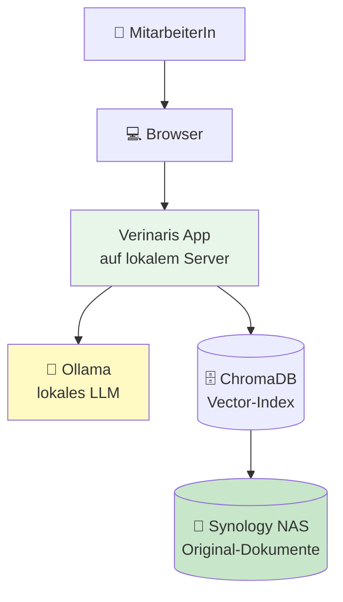
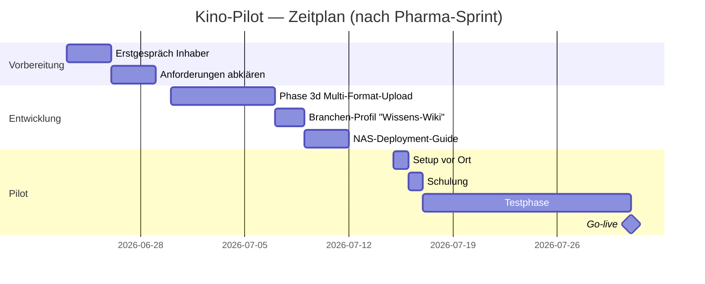

# 🎬 Use-Case-Briefing: Internes Wissens-Wiki

**Pilot-Anwender:** Kino in Koblenz (Lead über persönlichen Kontakt)
**Verallgemeinerung:** Branchen-agnostischer Use-Case "Wissens-Wiki"
**Plattform:** Verinaris Corporate LLM Platform

---

## 🎯 Das Problem

MitarbeiterInnen verbringen Zeit damit, in mehreren digitalen Dokumenten nach Antworten zu suchen — wie laufen Gutschriften? Was sind die Schritte bei einer Rückerstattung? Welcher Ablauf gilt beim Ticketverkauf?

Heute: **manuelle Suche durch alle Dokumente**
Morgen: **Frage stellen, Antwort mit Quellenangabe bekommen**

---

## 💡 Die Lösung

Ein internes "Wikipedia" auf Basis der vorhandenen Dokumente, das via Chat-Frage durchsucht wird. Die Antwort kommt mit Quellenangaben (welches Dokument, welche Seite) und kann direkt nachgeprüft werden.

### Architektur (alles lokal)



**Was niemals das Haus verlässt:**
- ✅ Die Original-Dokumente
- ✅ Die Mitarbeiter-Fragen
- ✅ Die KI-Antworten
- ✅ Die Suchhistorie

---

## 🔧 Technische Komponenten

**Bereits fertig in Verinaris:**

| Komponente | Status | Was es kann |
|---|---|---|
| FastAPI-Backend | ✅ | API für alle Funktionen |
| Streamlit-Frontend | ✅ | Browser-UI, mobile-fähig |
| PDF-Upload + Chunking | ✅ | PDFs einlesen, indexieren |
| Ollama-Integration | ✅ | Lokales LLM ohne Cloud |
| RAG mit ChromaDB | ✅ | Semantische Suche mit Embeddings |
| Quellenangaben in Antworten | ✅ | EU-AI-Act-konform |
| Multi-User mit Rollen | ✅ | Admin / Compliance / User |
| Audit-Log | ✅ | Wer hat wann was gefragt |
| DSGVO Art. 15+17 | ✅ | Daten-Export, Recht auf Löschung |

**Was speziell für Kino noch dazu kommt:**

| Komponente | Aufwand | Phase |
|---|---|---|
| Word-Upload (`.docx`) | ~3h | 3d |
| Excel-Upload (`.xlsx`) | ~3h | 3d |
| Branchen-Profil "Wissens-Wiki" | ~2h | 5d |
| NAS-Deployment-Guide | ~4h | 8a |
| Vor-Ort-Setup + Schulung | ~1 Tag | Service |

→ **Realistisch: 1-2 Wochen Arbeit für eine produktive Pilot-Installation.**

---

## 💰 Was es kostet (laufend)

| Position | Kosten |
|---|---|
| Software | 0 € (Open Source) |
| LLM-Nutzung | 0 € (lokales Ollama) |
| Cloud-Speicher | 0 € (alles auf NAS) |
| **Laufende Kosten** | **0 €** |
| Strom für Server | wenige € / Monat |

→ **Vorteil gegenüber ChatGPT-Pro o.ä.:** keine monatliche Lizenz, kein Daten-Leak, keine Cloud-Abhängigkeit.

---

## 🛡️ Compliance — was abgedeckt ist

| Anforderung | Verinaris-Antwort |
|---|---|
| DSGVO Art. 5 (Datenminimierung) | Daten verlassen das Haus nie |
| DSGVO Art. 25 (Privacy by Design) | Eingebaut, nicht nachgerüstet |
| DSGVO Art. 30 (Verarbeitungs-VZ) | Vorbereitet, dokumentierbar |
| EU AI Act Art. 13 (Transparenz) | Quellen-Pflicht in jeder Antwort |
| Kein "AI Decisioning" | Reine Recherche-Hilfe, keine Entscheidungen |

→ Für ein Kino keine "High-Risk"-Anwendung nach EU AI Act → minimaler Compliance-Aufwand.

---

## 📋 Was für ein Erstgespräch geklärt werden sollte

### Inhaltlich
- Welche Dokumente / Formate sollen rein? (Word, PDF, Excel, sonstiges)
- Wie viele Dokumente ungefähr?
- Wer soll Zugriff haben? (alle Mitarbeiter / nur Schichtleiter / ...)
- Sollen MitarbeiterInnen selbst Dokumente nachpflegen können oder nur Admins?

### Technisch
- Welches NAS-Modell? (Synology DS220+ aufwärts hat Docker via DSM 7+)
- Gibt es WLAN / Netzwerk-Infrastruktur im Kino?
- Sollen Mitarbeiter mobil zugreifen (Smartphone) oder nur PC?

### Geschäftlich
- Wer entscheidet final? (Inhaber / Geschäftsführer)
- Budget-Vorstellung?
- Zeitliche Erwartung?

---

## 🎯 Mögliches Modell — Pilot + Service

Für den Kino-Inhaber kann das Angebot lauten:

```
📦 Setup-Pauschale (einmalig)
   - Software-Installation auf NAS
   - Initial-Indexierung aller Dokumente
   - Schulung MitarbeiterInnen (1-2 Stunden vor Ort)

🔧 Service-Pauschale (optional, monatlich)
   - Updates der Plattform
   - Indexierung neuer Dokumente
   - Hotline bei Problemen
```

**Begründung der Trennung:** Das ist nicht "Plattform mieten" — die Software gehört dem Kino. Der Service-Vertrag ist freiwillig und jederzeit kündbar.

---

## 🚀 Realistische Roadmap



→ **Realistisch: Go-live Ende Juli/Anfang August 2026**.

---

## 💼 Strategischer Wert für Verinaris

Dieser Use-Case ist **mehr wert als nur ein Kunden-Mandat**:

1. **Beweis Skalierbarkeit:** Pharma war komplex, Kino ist einfacher → zeigt Plattform-Charakter
2. **Sales-Story:** "Patientendaten? Nein, Kino-Tickets — aber gleiche Architektur"
3. **Niedrige Compliance-Hürde:** Schnell zu Produktivität (Pharma dauert länger)
4. **Lokale Story:** Synology + Ollama als perfekte Datenhoheits-Demo
5. **Empfehlbarer Referenzkunde:** Lokaler Kino-Inhaber in Koblenz → nähebasierte Empfehlungen

---

## 🤔 Risiken — ehrliche Einschätzung

| Risiko | Wahrscheinlichkeit | Konsequenz | Gegenmaßnahme |
|---|---|---|---|
| Inhaber sagt "zu teuer" | Mittel | Kein Pilot | Sehr niedrigen Einstiegspreis anbieten, da Referenz-Wert |
| NAS reicht performance-mäßig nicht | Mittel | Setup-Komplexität | DS920+ aufwärts empfehlen |
| MitarbeiterInnen nutzen es nicht | Mittel | Pilot scheitert | Onboarding-Schulung und einfache Erst-Fälle |
| Falsche Antworten der KI | Niedrig (RAG mit Quellen) | Vertrauensverlust | Quellen-Pflicht macht Verifikation einfach |
| Datenschutz-Bedenken | Niedrig (alles lokal) | Bedenken | Klar kommunizieren: "Daten verlassen das Haus nie" |

---

## ✅ Konkrete nächste Schritte

### Vor dem Erstgespräch
- [ ] Mit Sohn Kontext klären: Was wäre dem Inhaber wichtig?
- [ ] Demo-Video vorbereiten (3 Min, in Pharma-Sprint sowieso geplant)
- [ ] Eine Beispiel-Dokumentation als "Was-wäre-wenn" durch-indexieren

### Im Erstgespräch
- Probleme verstehen, nicht direkt verkaufen
- Nutzen-Beispiele aus seinem Alltag finden
- Realistische Erwartungen setzen ("KI ist gut, aber kein Wahrsager")
- Falls Interesse: technische Klärung NAS / Netzwerk

### Nach dem Erstgespräch
- Konkretes Angebot mit Setup-Pauschale + optionalem Service
- Zeitplan, der mit Pharma-Sprint kollidiert? Klar kommunizieren
- Demo-Termin vereinbaren (mit Verinaris-Showcase + Beispiel-Indexierung)

---

*Stand: Juni 2026 — Skizze als Vorbereitung für Erstgespräch*
